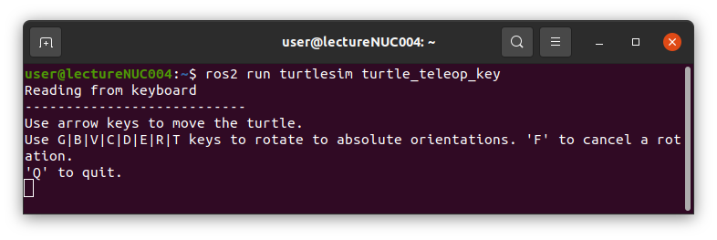

# Windows11(WSL2)でのROS2Humble環境構築(pixiによる簡略版)

Widnows11にWSL2をインストールする方法については、下記の技術ブログを参考に進めてください。  
下記の記事の「3. WSL 上に ROS2 をインストールする」以降は、本資料の内容で行うことで資料のプログラムが実行可能です  


[WSL2 で ROS2 Humble をインストールする方法](https://qiita.com/GAI-313/items/fd393ca505da814692d6#44-%E3%83%81%E3%83%A3%E3%83%AC%E3%83%B3%E3%82%B8%E3%81%97%E3%81%A6%E3%81%BF%E3%82%88%E3%81%86)


また、pixiを使わずに環境構築したい場合には、「3. WSL 上に ROS2 をインストールする」以降を[Ubuntu22.04でのROS2Humble環境構築(ROS2デフォルト)](Ubuntu22.04でのROS2Humble環境構築(ROS2デフォルト).md)の内容に置き換えることで環境構築が可能です。

## aptを最新の状態にする

```sh title=""
sudo apt update
sudo apt upgrade
```


## 開発時に良く使うものをインストールするをaptでインストールする

```sh title=""
sudo apt -y install curl gnupg lsb-release vim openssh-server net-tools git wget cmake
```


## (オプション)クラッシュレポートを非表示にする
開発時にROS2関連のプログラムやツールを使用していると予期せぬプログラム終了が起こることが多々ある。その際にクラッシュレポートが毎回出るのが邪魔になることがあるため、非表示オプションを記載する。
```sh
sudo sed -i 's/enabled=1/enabled=0/' /etc/default/apport
```

## pixiのインストール
```sh
curl -fsSL https://pixi.sh/install.sh | bash
```
インストール後にターミナルを1度閉じて開き直してから次に進んでください。ターミナルを開き直すことで設定が読み込まれます。

## pixiプロジェクトの作成
ホームディレクトリ(~/)で下記を実行し、`pixi_ros2`プロジェクトを作成する
```sh
cd ~/
pixi init pixi_ros2 -c robostack-staging -c conda-forge
```
プロジェクトを作成すると、プロジェクト名のディレクトリが作成され、`pixi.toml`ファイルが作成される。`cat`コマンドで中身を確認する。
```sh
cd pixi_ros2 && cat pixi.toml
```
以下が出力される。
```sh
[project]
channels = ["robostack-staging", "conda-forge"]
description = "Add a short description here"
name = "pixi_ros2"
platforms = ["linux-64"]
version = "0.1.0"

[tasks]

[dependencies]
```

ROS2環境用に`pixi.toml`ファイルを編集します。`[dependencies]`以下を下記のように変更します。`[activation.env]`も忘れずに追加してください。`[project]`と`[tasks]`は変更する必要はありません。  
テキストエディタは何を用いても良いですが、ここでは最初から入っている`nano`を用いる方法を記載します。  
ターミナルを開き、下記コマンドを入力し、`pixi.toml`を編集します。  
編集後、controlキー(CTRL)+`o`を押し、Enterキーで保存ができます。`nano`を閉じるにはcontrolキー(CTRL)+`x`を入力します。

```sh
cd ~/pixi_ros2
nano pixi.toml
```

```sh
[project]
channels = ["robostack-staging", "conda-forge"]
description = "Add a short description here"
name = "pixi_ros2"
platforms = ["linux-64"]
version = "0.1.0"

[tasks]

[dependencies]
ros-humble-desktop = ">=0.10.0,<0.11"
ros-humble-turtlesim = ">=1.4.2,<2"
colcon-common-extensions = ">=0.3.0,<0.4"
setuptools = ">=75.6.0,<76"
ros-humble-ament-cmake-auto = ">=1.3.7,<2"
compilers = ">=1.8.0,<2"
pkg-config = ">=0.29.2,<0.30"
cmake = ">=3.28.3,<4"
ninja = ">=1.12.1,<2"
ros-humble-turtlebot3-gazebo = ">=2.2.5,<3"
ros-humble-nav2-bringup = ">=1.1.13,<2"
protobuf = "4.25.1.*"
glog = "==0.6.0"

[activation.env]
ROS_DOMAIN_ID = "2"
TURTLEBOT3_MODEL = "waffle"
GAZEBO_MODEL_PATH = "$GAZEBO_MODEL_PATH:$PIXI_PROJECT_ROOT/.pixi/envs/default/share/turtlebot3_gazebo/models"

```
上記の`[dependencies]`は以下のインストールコマンドでも追加できますが、`[activation.env]`はエディタで追加する必要があります。
```sh
cd ~/pixi_ros2
pixi add ros-humble-desktop ros-humble-turtlesim colcon-common-extensions setuptools ros-humble-ament-cmake-auto compilers pkg-config cmake ninja ros-humble-turtlebot3-gazebo ros-humble-nav2-bringup "protobuf=4.25.1" glog==0.6.0
```

## 動作確認
```sh
cd ~/pixi_ros2
pixi shell
```
初回起動時(それ以降は`[dependencies]`に差分がある時)にインストールが開始されます。  
経験上、複数の`[dependencies]`を一括インストールした場合、途中で失敗するケースがあります。  
その際は、もう一度`pixi shell`コマンドを入力してください。失敗した途中の場所からインストールが再開されます。  
インストールが完了すると、ターミナルの先頭に`(pixi_ros2)`が表示されます。  
ターミナルの先頭に`(pixi_ros2)`が表示されている状態は、pixiの仮想環境に入っていることを表しています。  
pixiで環境構築を行なった場合には、コマンド入力前にターミナルの先頭に`(pixi_ros2)`が表示されている状態か確認して、コマンドを実行してください。

## pixi環境でのROS2動作確認
ROS2のチュートリアルでよく使われるturtlesimノードを起動して動作確認を行います。  

```sh
cd ~/pixi_ros2
pixi shell
ros2 run turtlesim turtlesim_node
```

上記コマンドを実行し下記のような青いウインドウが出てくれば成功です。ただし、初回起動時は、表示されるまで１分ほど時間がかかりますので、気長にお待ちください。  


表示されたら、上記のターミナルは残したまま、新しいターミナルを開き下記コマンドを実行します。

```sh
cd ~/pixi_ros2
pixi shell
ros2 run turtlesim turtlesim_node
```

コマンドを入力し以下のように出れば成功です。  



キーボード入力は、実行中のターミナルが選択されている状態で、  
矢印キー(↑↓→←)で入力し、↑↓キーで前後に進み、→←でその場で回転します。  
Qキーを押すことでノードが終了します。  
また、起動後ターミナル上に記載されている通り、G|B|V|C|D|E|R|Tキーを押すことで、Fキーを中心とした角度方向に亀が回転します。  
回転中にFキーを押すことで途中でキャンセルができます。

キーボード入力を行うと以下のように亀が動き、軌跡が描画されます。


プログラムを終了する場合には、controlキー(CTRL)+`c`を押すと停止します。  
pixi環境から抜けるには、controlキー(CTRL)+`d`を用います。

本資料では、その他のGUIとして`rviz2`と`gazebo`を用います。こちらも初回起動に時間がかかるため、動作確認として表示してみましょう。  
下記の画像のようなウインドウが開かない場合には、controlキー(CTRL)+`c`を押してプログラムを停止し、再度コマンドを実行してください。

```sh
cd ~/pixi_ros2
pixi shell
rviz2
```


```sh
cd ~/pixi_ros2
pixi shell
gazebo
```


以上のように表示できれば環境構築完了です。  
動作確認したコマンドやプログラム、ツールの詳細なチュートリアルは、補足資料にまとめています。  
講習では時間の都合上全てを説明できないため、SLAMに関連する項目のみ取り扱いますのでご了承ください。

## 開発を便利にする機能やショートカットキー
開発を便利にする機能やショートカットキーついて紹介します。 

### 標準ターミナル操作関連ショートカットキー
ROS2の開発では、ターミナルを大量に開きます。マウス操作は非常に時間がかかるため、キーボードショートカットを覚えましょう。

- controlキー(CTRL)+`d` : ターミナルウインドウを閉じたり、仮想環境ターミナルを抜けることが可能です。終了コマンドである`exit`と同様の機能があります。
- controlキー(CTRL)+`c` : コピー＆ペーストのコピーのショートカットキーとして有名ですが、ターミナル上で実行することでプログラムを停止できます。
- 矢印キー(上下): 前回入力したコマンドを再入力してくれます。

標準ターミナルよりも便利なターミナルアプリはたくさんあります。ネット上に色々紹介されているので自分に合ったものを探してみてください。

### ウインドウ画面配置の操作
キーボードにWindowsキーがある場合、矢印キー(左右)と組み合わせることで、画面配置を変更することができます。  
下記のようにGazeboとRvizを同時に見たい場合などは非常に便利です。


