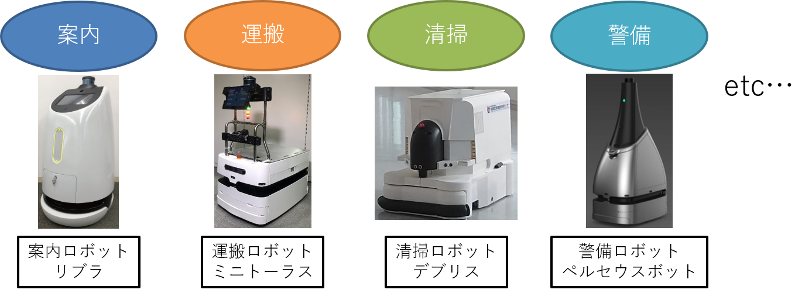

# ROS2の概要

自律走行ロボットを作る際に、ROS2を使うと何がうれしいのかという観点から、ROSの概要について説明していきます。

---

## 1. 自律走行ロボットの用途

まず自律走行ロボットは何ができて、何に使えるのかを考えます。

- 何ができる？
    - 目的地まで自律的に走行してくれる
- 何に使える？



<mark>__自律走行ロボットは様々な用途で使うことができます。__</mark>

---

## 2. 自律走行に必要なソフトウェア

自律走行を実現するために必要な機能は以下のようになります。

- 地図(地図作成)  
    自律走行を行う環境の地図を作成する  
    1. ロボットを走行させて地図を作成する(SLAM(Simultaneous Localization and Mapping))  
    2. 図面からの手書きで地図を作成する  
- 自己位置推定  
    現在ロボットが地図内のどこにいるか推定する  
- 経路計画  
    現在地から目的地までの経路を計画する  
- 経路追従  
    計画した経路に沿うようにロボットを制御する  
- 障害物停止・回避  
    走行中に現れる障害物を検知し、停止・回避動作を行う  

これらの機能は1つずつでも研究分野になっているほど高度な内容になります。

<mark>__自律走行を実現するためには多数の高度なソフトウェアが必要__</mark>

これに加えて、自律走行ロボットの実現には、

- センサのI/O
- ロボット本体のモーター制御
- ユーザーインターフェース(UI)
- コンテンツ(エンターテイメント関連の場合)
- 複数台ロボットを統合管理・制御する上位システム  
etc...

などのソフトウェアが必要になります。


---

## 3.ロボット用ミドルウェアについて

自律走行を実現するには多くのソフトウェアが必要です。
これらのソフトウェアを開発していくこと考えます。

全てのソフトウェアを1から作成する場合、時間がかかります。

<mark>→コアなところ以外はあり物を使いたい(オープンソースやライブラリなど)</mark>

しかし、データ形式が合わない、プログラミング言語が違うなどで、うまく進まないといったことが起こります。  
さらに、開発段階では、センサやアルゴリズムの追加/削除/変更などの試行錯誤が多く発生します。  

- 従来の開発スタイル  
単一の大きなプログラムとして開発してしまうと変更時に確認する項目が増えたり、一部の機能を他の用途で使いたい場合に大変であったりします。  
<mark>⇒再利用性がない(センサ等の変更に全コードを見直す必要がある)</mark>


<mark>これらの開発中に発生する課題を解決する方法としてロボット用ミドルウェアというものがあります。</mark>


- ロボット用ミドルウェアを用いた開発スタイル
    - ソフトウェアを部品化し、ソフトウェア間の通信インターフェース(データ形式)を共通化
    - 同じ通信インターフェースであれば部品の入れ替えが簡単
    - 異なるプログラミング言語のソフトウェア間の通信も可能
    - 入出力などでのミドルウェア特有のプログラム記述のおかげで他人のプログラムでも見通しが立てやすい
    - 通信インターフェイスが共通のためPC間やクラウド経由の通信も容易
    - <mark>ただし、デメリットとして通信の遅延や信頼性について考える必要が出てくる</mark>


<mark>__ロボット用ミドルウェアを用いることで開発効率が向上__</mark>

---

## 4. ROS2とは

- ROS2とは、Robot Operating System2の略で、ロボットソフトウェアプラットフォーム(ミドルウェア)の1つ。

- ROS2の概要
    - 世界で最も使われているロボット用ミドルウェアROSの次世代版
    - 便利な開発ツール・ライブラリが豊富(Rviz、rqt、Gazebo、Navigation2、MoveIt2 etc.)
    - サポート言語：(公式)C++,Python3、(非公式)Java,C#,Node.js,Rust,Go,Julia,Objective-C,Swift
    - 開発管理団体：Open Robotics、ROS2 Technical Steering Committee
    - 国内コミュニティ：ROS Japan User Group
    - ライセンス：BSD(商用利用可能)
    - 対応OS：Linux、MacOS、Windows10


クラウド連携やMatlab連携、ゲームエンジン連携(Unity,UE4/5)も進んでいる  

<mark>__ユーザ数が多く、関連ツール・ライブラリが豊富なため最も利用されている__</mark>

---

## 5. ROS2が提供してくれるもの

ROS2が提供してくれるものとして以下の4個が挙げられます。

- 通信ライブラリ  
    ソフトウェア間のやり取り(プロセス間通信)を容易にする通信ライブラリを提供(ほぼ意識することなく扱える)
- 開発ツール  
    起動、監視、デバッグ、可視化、シミュレーションなどの開発に必要なツールを提供
- 要素技術パッケージ  
    センサ、環境認識、動作計画、制御などのロボットを動かすために必要な要素技術をオープンソースとして大量に提供
- エコシステム  
    開発者、研究者などがソフトウェアをオープンソースとして公開し、手元で簡単に動作検証(プロトタイピング)できるエコシステムを提供(ただし、商用利用にはライセンスに注意)

---

## 6. ROS1とROS2の比較

### ROS1とROS2の比較
|                      | ROS1                                                      | ROS2                                                                                                 |
| -------------------- | --------------------------------------------------------- | ---------------------------------------------------------------------------------------------------- |
| ロボットの同時利用数 | 単体ロボットのみ対応(ROSマスタと呼ばれる単一障害点が存在) | 複数台ロボットにも対応(DDS(Data Distribution Service)の採用により単一障害点なし)                     |
| 計算資源             | 高性能計算機のみ対応(コアプログラムがC++)                 | 組み込みプラットフォームにも対応(コアプログラムがC)                                                  |
| リアルタイム制御     | 特別な作法で記述(ros_controlやnodelet)                    | 一般的なプロセス内・プロセス間通信(ros2_controlやexecutor(nodeletを標準化))                          |
| ネットワーク品質     | 高品質のみ対応(TCP通信ベースの独自通信プロトコルTCPROS)   | 欠損や遅延も許容(UDP通信ベースとQoS機能を備えたDDSの通信プロトコルRTPS(Real-Time Publish-Subscribe)) |
| プログラミング形式   | 最大限にユーザの自由                                      | 柔軟性を残しながらも形式を固定(executorやライフサイクルなどの新機能利用時は記述形式が固定)           |
| アプリケーション品質 | 研究、学術用途向け                                        | 製品化にも対応(製品化の際に課題となっていた部分(通信やセキュリティなど)の強化)                       |

- ROS1は主にプロトタイピングや研究開発に利用されていたが、そのまま製品化するにはいくつか問題点があった。  
- ROS2では製品化に対応できるように改善が行われている

---

### ROS1→ROS2変化

__改善機能__

- <mark>マルチOS対応</mark>(MacOSやWindows)
- <mark>Pythonのバージョンアップ</mark>(Python2→Python3)によりDeep Learningが扱いやすくなった
- <mark>launchがXML→Python3</mark>になったことでできることで起動時に条件設定などがしやすくなった(XML記述もサポートされているがROS2の新機能は非対応)
- <mark>パラメータの記述方式が統一</mark>(dynamic_reconfigureのような標準化)され、パッケージを利用する際の見通しが良くなった。注意点としてROS1ではROSマスタがパラメータサーバの役割をしていたので、パラメータをグローバル変数のように扱えたが廃止されたのでそのようには扱えない。ROS2は各ノードがそれぞれパラメータを持つので、各ノードに問い合わせる形式になる。
- サービス通信が基本非同期通信になった(同期通信も可能)
- アクション通信がコアライブラリに正式実装された
- <mark>ROS1のプロセス内通信方法であったnodeletの書き方が標準化されcomponet+executorとして推奨の書き方になった</mark>


__新機能__

- <mark>通信ライブラリにDDSが採用</mark>されたことで単一障害点であったROSマスタ(roscore)廃止
- <mark>コアプログラムC++→C</mark>により、組み込みマイコンや多くの言語でROS2を扱えるようになった
- 通信ライブラリにDDSが採用されたことで<mark>QoSを変更することで通信品質が制御可能</mark>になった
- DDSの種類を実行時に変更可能になった
- <mark>ノードの状態管理のためにライフサイクルが導入可能</mark>になり、起動順序制御や外部からの障害復帰処理が可能になった
- <mark>セキュリティ機能</mark>として、ノードの認証(偽ノードではないかの審議判定)、ドメイン(ROS_DOMAIN)へのアクセス制御、メッセージ通信へのアクセス制御、コンピュータ間通信での暗号鍵認証などが新規実装された
- linux-low-latencyカーネルによる<mark>リアルタイム制御が可能</mark>になった
- ROS1ノードとの相互接続機能

---

## 7. ROS1,ROS2のディストリビューション

各ディストリビューションの名前はアルファベット順になっており、毎年(5月23日)新ディストリビューションが公開される。Ubuntuの長期サポートと連動して、2年毎に長期サポートが公開されます。

|バージョン名|公開日|サポート終了日|備考|
|-|-|-|-|
|ROS1||||
|Kinetic Kame(ROS1)|2016年5月23日|2021年5月(EOL済み)|Ubuntu16.04|
|Melodic Morenia(ROS1)|2018年5月23日|2023年5月(EOL済み)|Ubuntu18.04|
|Noetic Ninjemys(ROS1)|2020年5月23日|2025年5月|Ubuntu20.04、ROS1最終バージョン|
|ROS2||||
|Foxy Fitzroy|2020年6月5日|2023年5月(EOL済み)|Ubuntu20.04、ROS2長期サポート|
|Galactic Geochelone|2021年5月23日|2022年11月(EOL済み)|Ubuntu20.04|
|Humble Hawksbill|2022年5月23日|2027年5月|Ubuntu22.04、ROS2初の5年長期サポート|
|Iron Irwini|2023年5月23日|2024年11月(EOL済み)|Ubuntu22.04|
|Jazzy Jalisco|2024年5月23日|2029年5月|Ubuntu22.04、ROS25年長期サポート最新バージョン|
|Rolling Ridley|2020年6月|未定|ROS2の継続開発用バージョン(新機能実験用)|


ROS1はNoeticが最終で2025年5月までサポート(ラスト1年)

ROS2は現状最新のJazzyがまだ半年前に出たばかりのため、本講習会では<mark>Ubuntu22.04+ROS2(Humble)</mark>を対象として行います。(最新の場合、OSSの更新が追いついていないケースがあるため一番使いやすいとは限りません)

MacOS、Windowsの場合、異なる部分や使えない機能などが少しありますが基本機能や概念などは本資料を流用できるかと思います。

---


## ※. LinuxとUbuntu
- Linuxはwindowsと同じOS(オペレーションシステム)
- UbuntuはLinuxディストリビューションの1つ


- ROS2は主に端末上でコマンド(文字)を用いて操作します
- 端末を開くショートカットキーがあるので積極的に使いましょう

---

## 端末でのコマンド操作練習


```sh
mkdir ~/test  　　　　       # ~/にtestフォルダを作成
ls ~/                       # ~/にtestフォルダの作成を確認
cd ~/test                   # ~/test/に移動
touch ~/test/test.txt       # ~/test/内にtest.txtファイルを作成
ls ~/test/                  # ~/test/の内容を確認
rm ~/test/test.txt          # ~/test/test.txtを削除
ls ~/test/                  # ~/test/の内容を確認
cd ..			    # 1つ上のフォルダ階層に移動
rm -r ~/test/               # ~/test/フォルダを削除
ls ~/                       # ~/の内容を確認
```


| コマンド名               | 説明                                                |
| ------------------------ | --------------------------------------------------- |
| ls                       | フォルダの内容をリスト形式で表示する                |
| cd [フォルダ名]          | 指定したフォルダに移動する                          |
| cd ..                    | 1つ上のフォルダ階層に移動する                       |
| mkdir [フォルダ名]       | フォルダを作成する                                  |
| touch [ファイル名]       | ファイルを作成する                                  |
| gedit [ファイル名]       | ファイルを作成し、gedit(テキストエディタ)を開く     |
| rm [ファイル/フォルダ名] | ファイル/フォルダを削除する                         |
| mv [移動元] [移動先]     | ファイル/フォルダを移動する                         |
| cp [移動元] [移動先]     | ファイル/フォルダをコピーする                       |
| find [検索キーワード]    | ファイル/フォルダを検索する                         |
| grep [検索キーワード]    | テキスト内を文字列検索する                          |
| history                  | コマンドの入力履歴を表示する                        |
| clear                    | 端末内の表示をクリアする                            |
| ifconfig                 | 接続されているネットワークの状況を確認する          |
| ping [IPアドレス]        | ネットワーク上にあるコンピュータまでの通信経路確認  |
| dmesg                    | カーネルが出力した情報を確認する(USBの認識確認など) |
| chmod +x [ファイル名]    | ファイルに実行権限を付与する                        |

- 他にもオプション機能などがある  
    例：ls -l  ・・・ファイルごとの詳細を表示する
- もっと知りたい場合はインターネットで”Linux コマンド”で検索
- <mark>よく使うショートカットキー</mark>  
    <mark>↑↓キー　   入力履歴を参照してくれる</mark>  
    <mark>Tabキー　    入力を補間・予測してくれる</mark>  
    <mark>Ctrl + C　　 端末で実行中の処理を終了する(プログラムの終了など)</mark>  

---


## ※. ソフトウェアライセンスについて
- 寛容型ライセンス
    - 自由な改変可能
    - ソースコードを開示しなくてもよい
    - ライセンスと著作権を表記で頒布可能
    - 代表例：BSD, MIT, Apache, TOPPERS等
- 互恵型ライセンス
    - 自由な改変可能
    - ソースコードの開示を求める
    - ライセンスと著作権を表記で頒布可能
    - 代表例：GPL, LGPL, MPL等
    - その他参考URL : http://www.jasa.or.jp/TOP/download/technical/ETIoT2015_JG-2text.pdf

- 参考書籍：
    - タイトル：OSSライセンスの教科書
    - 出版社：技術評論社
    - 著者：上田 理
    - 監修：岩井 久美子

<mark>オープンソースを利用する場合、ソフトウェアライセンスを確認する</mark>

---

## ROS2の概要まとめ

- 自律走行ロボットは様々な用途(<mark>案内・清掃・警備・運搬など</mark>)で使うことができる

- 自律走行を行うためには<mark>多数の高度なソフトウェアが必要</mark>

- ロボット用ミドルウェアを用いることで<mark>ソフトウェアが部品化でき、開発効率が向上</mark>

- ROS2はロボット用ミドルウェアの中でも、<mark>ユーザ数が多く、オープンソースソフトウェアが豊富で、関連ツールも充実</mark>


---