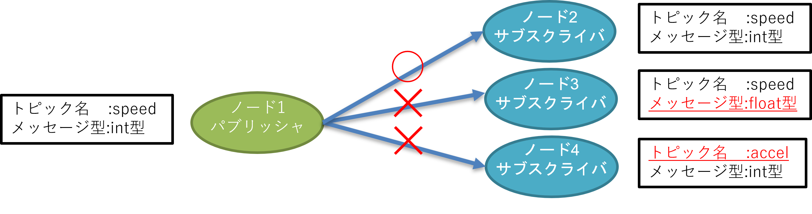

# ROS2の基礎とROS2コマンド
ROS2のチュートリアルとして使われているturtlesimパッケージを動かしながらROS2の基礎を学びましょう。

---

## 1. ROS1/ROS2の動作原理


ROS1/ROS2は、<mark>ノードと呼ばれる1つの機能を持つ実行可能な1個のプログラム</mark>を複数つなげていくことで動作します。  
ノードはROS1/ROS2における最小プロセスで、<mark>パッケージと呼ばれるROS1/ROS2ソフトウェアの基本単位</mark>で管理されます。  
各ノードは起動後、接続条件に合うノードを探索し、接続します。  
接続したノード間ではメッセージ通信と呼ばれるデータの送受信が開始されます。(メッセージ通信の説明は後述します。)  

|ROS2用語名称|説明|
|---|---|
|マスタ|(<mark>ROS2で廃止</mark>)ノードを接続するネームサーバーの役割(<mark>必須、ただし複数PC内で1個</mark>)|
|デーモン|(<mark>ROS2で新規</mark>)ノードを高速に発見するためのネームサーバーの役割(<mark>無しでも動作</mark>)|
|ノード|機能や目的で細分化したROS2の最小プロセス(<mark>実行可能な1個のプログラム</mark>)|
|パッケージ|<mark>ROS1/ROS2ソフトウェアの基本単位</mark>(パッケージ内にノードを配置する)|
|メタパッケージ|共通の目的を持つ<mark>パッケージの集合体</mark>(例:navigation2など)|
|メッセージ通信|ノード間でデータの送受信を行う仕組み|


ROS2では<mark>中央集権的にノード間の通信接続を行っていたマスタにあたるroscoreが廃止</mark>され、<mark>各々のノードが他ノードを分散発見する形式</mark>に変更されました。  
これにより、単一障害点がなくなり、ROS2ネットワーク上の障害で一度に不具合を起こしてしまう心配がなくなりました。  

しかし、大規模なロボットシステムになると分散発見を行う場合、全てのノードを発見するまで時間がかかってしまいます。  
この問題を解決するために、ROS2ではデーモンと呼ばれる、参照することで高速にノードを発見できるものをバックグラウンドで起動しておけます。  
ROS2ノードの挙動としては、デーモンが存在すれば参照して高速発見、なければ分散発見を行います。  

__ROS1ではマスタがノード間を繋ぐ役割を行っていたが、<mark>マスタに不具合が出ると全ノードに不具合が出てしまうため廃止されました。</mark>__

__<mark>ROS2ではDDSによって各ノードが接続相手を探して繋がるようになりました。(分散発見)</mark>__

デーモンは`ros2 node list`や`ros2 topic list`などのROS2ネットワーク上を探索する際に自動起動されます 


---

### DDS(Data Distribution Service)について
- DDSはOMG(object Management Group)で策定された通信仕様でPub/Sub通信とよく似たデータ転送機能を提供します。
- OMGによって策定されたIDL(Interface Description Language)を用いて、メッセージを定義し、シリアライズします。
- DDSではPub/Sub通信に必要となる送信元、受信先の発見メカニズムは、分散化されており、システムは単一障害点がなくなり、自由度が高くなります。
- DDSはデフォルトでUDPを使用しますが、Quality of Service (QoS) と呼ばれるパラメータを使って通信の信頼性を制御でき、TCPのような通信調整も可能です。
- DDSは、金融・宇宙・航空・電車などの大規模システムで採用されており、信頼性が高い。

ROS2で使用できるDDSの種類としては下記のものがあります。

- FastRTPS(eProsima): Tier1
- CycloneDDS(Eclipse): Tier1
- ConnextDDS(RTI): Tier1
- GurumDDS(GurumNetworks): Tier3

ROS2HumbleでのデフォルトはFastRTPSです。  

また、近年ではZenoh(Zero network overhead protocol)と呼ばれるDDSを用いない新しいPub/Sub方式の通信ライブラリにも入れ替えられるようになってきています。  
特徴としては、ネットワーク内ではDDSライク、ネットワーク間ではMQTTライクに動作し、インターネット越し通信が簡単にできる点です。  
[詳しくはこちらを参照してください](https://speakerdeck.com/takasehideki/rosconjp-20240925)  


!!! Navigation2実行に際してのFastRTPSの不具合
    しかし、下記で議論されているように、現在Navigation2(Nav2)との不具合が発生しているため、講習会ではパラメータ変更したCycloneDDSを使用しております。 

    [Navigation2 Issues #3014](https://github.com/ros-planning/navigation2/issues/3014)

    ただし、この設定変更は全てのROS2プログラムに最適なものではありません。現在確認している事象は下記になります。  

    - FastRTPSをNav2で使用するとlocal costmapが生成されないことが良く起こり、この状態だと障害物回避ができずに衝突してしまう
    - Nav2に関してはCycloneDDSに変更すると不具合なく動作する。
    - 講習会環境(Intel NUC8i5)でのCPU使用率は、Nav2のComposition実行ではFastRTPSは45%、CycloneDDSは気持ち高い程度でほぼ同等
    - depthai-rosパッケージ(OAK-Dカメラ)などの画像伝送で使用しているComposition実行はCycloneDDSは100%超え、FastRTPSは40%程度で、FastRTPSが良い

    よってHumbleの場合はデフォルトをCycloneDDSに変更し、画像処理や点群処理で重いところをComponent化して、実行時にFastRTPSにするのが現状の最適解だと考えています。  
    また、このようにパフォーマンスを調整可能な部分はROS1にはなかったものになります。

    DDSの入れ替えと調整は下記が参考になります。

    - [DDS-Implementations](https://docs.ros.org/en/humble/Installation/DDS-Implementations.html)
    - [DDS-tuning](https://docs.ros.org/en/foxy/How-To-Guides/DDS-tuning.html)

    DDSの日本語参考サイト

    - [DDS (Data Distribution Service) とは](https://www.youtalk.jp/2017/05/28/dds.html)
    - [けっきょくROSってなんなのか？ 〜IoT的に気になるDDS通信機能を徹底解剖する〜](https://speakerdeck.com/takasehideki/ketukiyokurostutenannafalseka-iotde-niqi-ninaruddstong-xin-ji-neng-woche-di-jie-pou-suru?slide=24)
    - [駆け抜けるROS2](https://zenn.dev/hakuturu583/articles/ros2_turtorial)

    DDS関連論文

    - [Latency Analysis of ROS2 Multi-Node Systems](https://arxiv.org/abs/2101.02074)
    - [AuthROS: Secure Data Sharing Among Robot Operating Systems Based on Ethereum](https://arxiv.org/abs/2208.14269)
    - [ROS2における通信特性に応じたDDS実装の動的選択機構の実現](https://ipsj.ixsq.nii.ac.jp/ej/?action=repository_uri&item_id=186376&file_id=1&file_no=1)
    - [ROS2と軽量DDSの組込みシステムに対する適用性評価](https://ipsj.ixsq.nii.ac.jp/ej/?action=pages_view_main&active_action=repository_view_main_item_detail&item_id=190319&item_no=1&page_id=13&block_id=8)
    - [ロボティクスミドルウェアROS,ROS2,Ignition,Isaacの機能比較と通信評価](https://jglobal.jst.go.jp/detail?JGLOBAL_ID=202002240535367632)
    ⇒オープンアクセスではない、上記の【駆け抜けるROS2】内に抜粋説明がある。


---


## 2. ROS2を動かしてみる(turtlesim)

### ノードの起動方法

さて動作原理について説明しましたが、実際にROS2動かしながらROS2の基礎を学んでいきます。   
ROS2のチュートリアルで使われている`turtlesimパッケージ`内の`turtlesim_nodeノード`と`turtle_teleop_keyノード`を起動しながらROS2の使い方を説明します。    
まずROS2に関する操作はコマンドライン(端末)上で<mark>ROS2コマンド</mark>と呼ばれるもので行います。  
ROS2コマンドの種類については各コマンドで<mark>-hオプション</mark>を参照してください。


ノードを起動する方法は以下の2種類のROS2コマンドがあります。
```sh
① ros2 run コマンド
② ros2 launch コマンド
```
①は1個のノードを起動し、②は複数のノードを起動します。

①の使い方は以下のように、起動したいノードの<mark>パッケージ名</mark>と<mark>ノード名</mark>が必要になります。
```sh
ros2 run [パッケージ名] [ノード名]
# 詳細についてはros2 run -h で確認できます。
```
②の使い方は以下のように、<mark>launchファイルが必要</mark>になります。launchファイルの書き方については後述します。
また、パッケージ内にlaunchファイルを配置することでlaunchファイルを探しやすくなります(通常はこの方法)。
```sh
ros2 launch [launchファイル名(相対or絶対パス)]
ros2 launch [パッケージ名] [launchファイル名]
```
__<mark>ROS2ノードの起動にはパッケージ名とノード名が必要</mark>__

__<mark>launch起動にはlaunchファイルが必要</mark>__

---

### turtlesim_nodeの起動

`turtlesimパッケージ`に含まれている、`turtlesim_nodeノード`は、速度指令値を購読して動く亀を作り出す2Dシミュレータです。  
`turtlesim_nodeノード`を起動するため、端末を開き(Ctrlキー+Altキー+T)、以下のコマンドを入力します。  

<mark>コマンドを入力する際はTabキー補完を使用しましょう(使い慣れていない方は特に使用すること)。</mark>    
例えば、"ros2 run tu"のところでTabキーを押すことで"ros2 run turtlesim"まで自動で入力されます。  
補完候補が複数ある場合は、入力されず、もう一度Tabキーを押すことで候補が表示されます。  
```sh
ros2 run turtlesim turtlesim_node
```


コマンドを入力し、以下のように出れば成功です。


コマンドを入力すると以下のような画面が出てきます。


続いて亀を動かすための速度指令値をキーボード入力から出力する`turtle_teleop_keyノード`を起動します。

---

### turtle_teleop_keyの起動

`turtlesimパッケージ`に含まれている、`turtle_teleop_keyノード`は、キーボード入力から速度指令値を配信します。

`turtle_teleop_keyノード`を起動するため、端末を開き(Ctrlキー+Altキー+T)、以下のコマンドを入力します。
```sh
ros2 run turtlesim turtle_teleop_key
```


コマンドを入力し以下のように出れば成功です。

キーボード入力は、実行中の端末が選択されている状態で、  
矢印キー(↑↓→←)で入力し、↑↓キーで前後に進み、→←でその場で回転します。  
Qキーを押すことでノードが終了します。  
また、起動後端末上に記載されている通り、G|B|V|C|D|E|R|Tキーを押すことで、Fキーを中心とした角度方向に亀が回転します。  
回転中にFキーを押すことで途中でキャンセルができます。  


キーボード入力を行うと以下のように亀が動き、軌跡が描画されます。


---

### ノードの起動確認方法

ノードが起動したかどうかを確認する方法として、以下の2種類があります。
```
① ros2 node list
② rqt_graph 
```
①はコマンドライン上(CLI)で起動しているノードの情報を表示し、②はノードの接続関係を絵として可視化(GUI)します。

①の使い方は以下のように、listで起動しているノードの名前一覧を表示できます。  
起動しているノードの数が多くなってくると起動しているのにlistで表示されないことがあります。  
その場合は面倒ですが--no-daemonオプションをつけることをオススメします。  
```sh
ros2 node list
ros2 node list --no-daemon #(推奨)
#コマンドの詳細については、ros2 node -h で確認できます。
```
②使い方は、以下のようにコマンドを入力するだけでGUIが立ち上がります。
```sh
rqt_graph
```
以下のようなGUIが立ち上がり、左上の更新ボタン(青矢印)を押すことで<mark>楕円がノード、長方形がトピック</mark>を表します。


ノード数が少ない場合には便利ですが、自律走行のようにノード数が増えると見づらくなります。


---

## 3. ROS2の通信方式(メッセージ通信)

ROS2で`turtlesim`を動かしました。`turtlesim_nodeノード`は`turtle_teleop_keyノード`から速度指令値を受け取り動作していました。
この通信方式はメッセージ通信と呼ばれ、トピック・サービス・アクション・パラメータの4種類があります。

---

### メッセージ通信の種類


|ROS2用語名称|説明|
| --- | --- |
|トピック|センサ等の連続的なデータ通信が必要な時に使用する通信(単方向非同期通信)|
|サービス|状態確認等の要請後に即時応答が必要な時に使用する通信(双方向同期通信)|
|アクション|目標地点への移動指令など、要請後の応答に時間がかかる処理を呼び出す場合や処理中の中間結果が必要な時に使用する通信(双方向非同期通信)|
|パラメータ|移動速度の最大値など、ノードのパラメータ変更時に使用される通信|

`turtlesim`での通信方式は<mark>矢印入力がトピック通信、ローマ字入力がアクション通信</mark>になります。

---

### トピック通信




トピック通信は、送受信するデータの経路を<mark>トピック</mark>、データを<mark>メッセージ</mark>と呼び、

- データ(メッセージ)を送信する<mark>パブリッシャ(Publisher)(配信者)</mark>
- データ(メッセージ)を受信する<mark>サブスクライバ(Subscriber)(購読者)</mark>

の2つから構成されます。

- トピックは名前で管理され、任意の名前をつけることができます。またメッセージはデータ型を持ち、整数・小数・文字列・Bool等の基本的な型や、よく使う組み合わせ型(構造体)があらかじめ用意されています。使いたいデータ型がない場合は独自でデータ型を定義することも可能です。

- トピック通信を行うには、<mark>同じトピック名・メッセージ型であれば自動的に接続</mark>され、データ通信が行われます。
- 処理の流れとしては、パブリッシャがトピックをパブリッシュすると、サブスクライバ側でコールバック関数が呼び出され、トピックが取得できます。
- 一度接続されると、それ以降は連続してデータ通信が行われるため、センサデータの取得などに利用されます。

- 1:1の通信以外にも、1:多、多:1、多:多の通信が可能です。

- トピック名とメッセージ型が同じであれば、実装言語やOSが異なっていても通信が可能です。  
- また、1つのノードに複数のパブリッシャとサブスクライバを用いることができます。


用意されているメッセージ型の一覧を確認する場合は`interfaceコマンド`で確認できます。
```bash
# 下記の2つは同様にメッセージ型の名前一覧を表示するコマンド
ros2 interface list -m
ros2 interface list --only-msgs
# メッセージ型の詳細を確認するコマンド
ros2 interface show [メッセージ型の名前]
ros2 interface show std_msgs/msg/String
```

__トピック通信は、パブリッシャからサブスクライバへの単方向非同期通信__  

__トピック通信を行うには、<mark>トピック名とメッセージ型を同じにする必要がある</mark>__

---

### サービス通信


- サービス通信はサービスサーバとサービスクライアントの2つから構成されます。

- __サービス通信は、クライアントから要請(リクエスト)を送り、サーバが応答(レスポンス)を返す双方向同期通信です__(<mark>他のノードにある関数を呼び出し、戻り値を受け取るような挙動</mark>)。

- サービス通信もトピック通信と同様に名前とデータ型で管理されています。  
- サービス通信のデータ型(サービス型)も少ないですが予め用意されているものがあります。使いたいデータ型がない場合は独自でデータ型を定義することも可能です。

- 処理の流れとしては、クライアントがリクエストすると、サーバー側でコールバック関数が呼び出され、リクエスト値が取得できます。その後サーバー側処理を行いレスポンスを返すと、クライアント側でレスポンス値が取得できます。

- サービス通信は主に、特定の状況で1度のみ実行し即時に結果が得られる場合に用います。具体的には、ロボットの現在のステータスを確認や保存する場合などの際に使用されます
- トピック通信との違いは、1対1の通信であることと応答(レスポンス)が帰ってくることです。この応答により、要請(リクエスト)の成否などが分かるため、クライアント側のエラー処理などが実装しやすくなります。

- また、サービスを早い周期で何度も呼び出すとエラーになることがあります。そのような処理がしたい場合にはトピック通信を２つ用いることで代用することもできます。  

用意されているサービス型の一覧を確認する場合はinterfaceコマンドで確認できます。
```bash
# 下記の2つは同様にサービス型の名前一覧を表示するコマンド
ros2 interface list -s
ros2 interface list --only-srvs
# サービス型の詳細を確認するコマンド
ros2 interface show [サービス型の名前]
ros2 interface show std_srvs/srv/Empty
```

__サービス通信は、クライアントからリクエストを送り、サーバがレスポンスを返す双方向同期通信__  

__サービス通信を行うには、<mark>サービス名とサービス型を同じにする必要がある</mark>__

---

### アクション通信


- アクション通信は、アクションサーバとアクションクライアントの2つから構成されます。  
- アクション通信は、クライアントから要請(リクエスト)を送り、サーバがフィードバックと呼ばれる処理中の中間結果を一時的なトピック通信で返し、処理が完了すると結果(リザルト)として返す双方向非同期通信です。  
- これは、サービス通信とトピック通信を組み合わせた通信方式になっています。
- <mark>この通信特徴は中間結果が得られることと、途中でキャンセルが可能なことです。</mark>

- アクション通信も他の通信方式と同様に名前とデータ型で管理されています。  
- アクション通信のデータ型は予め用意されているものはないため、基本的に独自定義することになります。

- アクション通信は主に要請後の応答に時間がかかる場合や処理中の中間結果が必要な場合に使用されます。  具体的には、自律走行時の目的地を指定し、到達するまでの中間結果を返し、最終的に目的地に到達したかを結果として返すような使われ方をします。

用意されているアクション型の一覧はinterfaceコマンドで確認できます。
```bash
# 下記の2つは同様にアクション型の名前一覧を表示するコマンド
ros2 interface list -a
ros2 interface list --only-actions
# アクション型の詳細を確認するコマンド
ros2 interface show [アクション型の名前]
ros2 interface show turtlesim/action/RotateAbsolute
```

__アクション通信は、クライアントからリクエストを送り、サーバが処理中の中間結果をフィードバックで返し、完了すると結果(リザルト)を返す双方向非同期通信(途中でキャンセル処理が可能)__  

__アクション通信を行うには、<mark>アクション名とアクション型を同じにする必要がある</mark>__


---

### パラメータ通信
- パラメータは、<mark>各ノードが持つ構成値</mark>です。  
- <mark>ノード起動時に変更が可能で、ソースコードを変更することなく実行時解決ができます。</mark>  
- ノード内での実装方法によりますが、<mark>実行中に変更することも可能</mark>です。  
- パラメータには整数・小数・文字列・Bool・リスト等の基本的な値を設定することができます。  
- ROS2では各ノードが独自でパラメータを管理しています。なのでROS1の時に、すべてのノードから参照できるグローバルパラメータのような使い方はできなくなりました。  
- もし、どうしてもグローバルパラメータを使用したいときには、`demo_nodes_cppパッケージ`の`parameter_blackboardノード`を使用することで実現できます。
- <mark>ROS2のパラメータはサービス通信のような実装になっており、クライアントから要請されると、パラメータサーバ内のコールバック関数が呼ばれ、処理されます。</mark>

現在起動しているノードのパラメータを一覧はparamコマンドで確認できます。
```sh
# 全ノードのパラメータ名を一覧で確認
ros2 param list
# ノードのパラメータ値を取得する
ros2 param get [ノード名] [パラメータ名]
# ノードのパラメータ値を変更する
ros2 param set [ノード名] [パラメータ名]
```
__パラメータは、ノードが持つ構成値で、ソースコードを変更せずに起動時や実行時に変更ができる__

__ROS2のパラメータはサービス通信のような実装になっており、クライアントから要請されると、パラメータサーバ内のコールバック関数が呼ばれ、処理される__

---

## 4. ROS2コマンドでトピック通信を調べる


準備として、`turtlesim_nodeノード`と`turtle_teleop_keyノード`の2つが立ち上がっている状態を用意します。  
過去に起動していた端末を全て落とします。(Ctrl+dの端末終了のショートカットキーが便利です)  
その後2つのノードを起動します  
```sh
# turtlesim_nodeノードの起動
ros2 run turtlesim turtlesim_node
# turtle_teleop_keyノードの起動
ros2 run turtlesim turtle_teleop_key
```

以下のROS2コマンドを用いてノードとトピックの情報を調べ、`turtlesim_nodeノード`と`turtle_teleop_keyノード`の2つノード間で流れているトピック名とメッセージ型を調べる


①実行中のノードをリスト表示する
``` sh   
ros2 node list
# デーモンを使わずに探索
ros2 node list --no-daemon
```
②ノード情報を表示する
```sh
# ros2 node info [ノード名]
ros2 node info /turtlesim
``` 
③トピックのリストを表示する
```sh
ros2 topic list
# メッセージ型名も表示
ros2 topic list -t
```
④トピックのメッセージ型名を表示する
```sh
# ros2 topic info [トピック名]
# ros2 topic type [トピック名]
ros2 topic type /turtle1/cmd_vel
```
⑤メッセージ型のデータ構造を表示
```sh
# ros2 interface show [メッセージ型名]
ros2 interface show geometry_msgs/msg/Twist
```

①～⑤までで、トピック名(`/turtle1/cmd_vel`)とメッセージ型(`geometry_msgs/msg/Twist`)の名前とデータ構造が調べられました。  
⑥では実際に流れているトピックを確認し、⑦ではコマンドラインからトピックを配信してturtlesim_nodeの挙動を確認してみましょう。  

⑥配信されているトピックのデータを確認する
```sh
# ros2 topic echo [トピック名]
ros2 topic echo /turtle1/cmd_vel
```
⑦トピックを配信してみる
```sh
# ros2 topic pub [トピック名] [メッセージ型名] [出力値]
ros2 topic pub /turtle1/cmd_vel geometry_msgs/msg/Twist "{linear: {x: 0.0,y: 0.0,z: 0.0},angular: {x: 0.0,y: 0.0,z: 1.0}}"
```

---

### ROS2での単位系
速度指令トピックの情報は見えましたが、単位がありません。これはROS2内で単位系が規定されているためです。  

- ROS2ではSI単位系が基本です。
- オープンソースなどの他のノードと接続させることを考えると、自作ノード内でもSI単位系に統一しておくと良いです。
- パッケージによっては出力単位がSI単位系でない場合もあるので初めて使用するノードは確認した方が良いです。

| 量     | 単位(名称)   | 単位(記号) |
| ------ | ------------ | ---------- |
| 長さ   | メートル     | m          |
| 質量   | キログラム   | kg         |
| 時間   | 秒           | s          |
| 電流   | A            | アンペア   |
| 角度   | ラジアン     | rad        |
| 速度   | メートル毎秒 | m/s        |
| 角速度 | ラジアン毎秒 | rad/s      |


---

### ROS2の座標系
- 右手座標系を使用する
- 軸の方向  
    X軸：正面  
    Y軸：左向き  
    Z軸：上向き  
- 回転方向  
    右手方向が正


---

## 5. ROS2コマンドでサービス通信を調べる

`turtlesim_node`には新しいカメを生み出すサービス通信`/spawn`がある。これを使いサービス通信の使い方を学ぼう。  
以下のROS2コマンドを用いてノードのサービス情報を調べ、サービス名とサービス型を調べます  


①②は2-4と同様のため省略  
③サービスのリストを表示する
```sh
ros2 service list
# サービス型名も表示
ros2 service list -t
```
④サービスのサービス型名を表示する
```sh
# ros2 service type [サービス名] 
ros2 service type /spawn
```
⑤サービス型のデータ構造を表示する
```sh
# ros2 interface show [サービス型名]
ros2 interface show turtlesim/srv/Spawn
```
⑥サービス要請を行ってみる
```sh
# ros2 service call [サービス名] [サービス型名] [リクエスト値]
ros2 service call /spawn turtlesim/srv/Spawn "{x: 2, y: 2, theta: 0.2, name: ''}"
# nameが空欄の場合はturtle2が割り当てられる
```


---

## 6. ROS2コマンドでアクション通信を調べる

`turtlesim_node`には指定の角度になるように回転するアクション通信`/[名前空間]/rotate_absolute`がある。これを使いアクション通信の使い方を学ぼう。  
以下のROS2コマンドを用いてノードのサービス情報を調べ、アクション名とアクション型を調べます  

①②は2-4と同様のため省略  
③アクションのリストを表示する
```sh
ros2 action list
```
④アクションのアクション型名を表示する
```sh
ros2 action list -t
# ros2 action info [アクション名] -t
ros2 action info /turtle1/rotate_absolute -t
```
⑤アクション型のデータ構造を表示する
```sh
# ros2 interface show [アクション型名]
ros2 interface show turtlesim/action/RotateAbsolute
```
⑥アクション要請を行ってみる
```sh
# ros2 action send_goal [アクション名] [アクション型名] [リクエスト値]
# フィードバックを表示する
# ros2 action send_goal [アクション名] [アクション型名] [リクエスト値] --feedback
ros2 action send_goal /turtle1/rotate_absolute turtlesim/action/RotateAbsolute "{theta: 1.57}"
```

---

## 7. ROS2コマンドでパラメータを調べる
`turtlesim_node`には背景色のパラメータ`/background_*`がある。これを使いパラメータの使い方を学ぼう。  
以下のROS2コマンドを用いてノードを調べ、パラメータ名と設定値を調べます  

①は2-4と同様のため省略
②パラメータのリストを表示する(--param-typeでデータ型追加表示)
```sh
ros2 param list --param-type
# 特定のノードのパラメータ名を表示する
# ros2 param list [ノード名]
ros2 param list /turtlesim
```
③パラメータの値を取得
```sh
# ros2 param get [ノード名] [パラメータ名]
ros2 param get /turtlesim background_b
```
④パラメータの定義を取得(値域や説明)
```sh
# ros2 param describe [ノード名] [パラメータ名]
ros2 param describe /turtlesim background_b
```
⑤パラメータに値をセット
```sh
# ros2 param set [ノード名] [パラメータ名] [設定値]
ros2 param set /turtlesim background_b 128
```
⑥特定のノードのパラメータを一括でyamlに書き出す(ノード名.yamlになる)
```sh
# ros2 param dump [ノード名] 
# ファイルに書き出さずに端末に表示するだけ
# ros2 param dump [ノード名] --print
ros2 param dump /turtlesim
# 実行した端末の場所にturtlesim.yamlが生成される
```
⑦パラメータをyamlで一括変更
```sh
# turtlesim.yamlの値を編集し、パラメータを一括変更
# ros2 param load [ノード名] [yamlファイル]
ros2 param load /turtlesim turtlesim.yaml
```

---

## 8. 自分でノード間通信(メッセージ通信)を繋げてみる
`/spawnサービス`で2匹目のカメを呼び出しましたが、まだ動かせていません。速度指令を送信して動かしてみましょう  

- 2匹目のカメを動かすための速度指令は下記のようになっています。([name]は/spawnで指定したカメの名前)  
    - トピック名：/[name]/cmd_vel
    - メッセージ型：geometry_msgs/msg/Twist
- 1匹目のカメを動かしていた`turtle_teleop_keyノード`のデフォルトトピック名は、`/turtle1/cmd_vel`でした。
- トピック通信は、トピック名とメッセージ型が一致していないと通信されないので、トピック名の変更が必要です。
- `ros2 runコマンド`のオプションを用いることで、起動時にトピック名やパラメータ値などを変更して起動することができます。
- この名前変更は<mark>remap</mark>と呼ばれ、プログラムを変更せずに実現ができます。
    
```sh
# ノード名を変更して起動する
ros2 run [パッケージ名] [ノード名] --ros-args -r __node:=[ノード名]
# トピック名を変更して起動する
ros2 run [パッケージ名] [ノード名] --ros-args -r [トピック名]:=[変更後のトピック名]
# サービス名を変更して起動する
ros2 run [パッケージ名] [ノード名] --ros-args -r [サービス名]:=[変更後のサービス名]
# アクション名を変更して起動する
ros2 run [パッケージ名] [ノード名] --ros-args -r [アクション名]:=[変更後のアクション名]
# パラメータ値を変更して起動する
ros2 run [パッケージ名] [ノード名] --ros-args -p [パラメータ名]:=[パラメータ値]
# yamlでパラメータを一括変更して起動する
ros2 run [パッケージ名] [ノード名] --ros-args --params-file [yamlファイル名]
# 複数変更して起動する場合は、下記のようにする
ros2 run [パッケージ名] [ノード名] --ros-args -p [パラメータ名]:=[パラメータ値] -p [パラメータ名]:=[パラメータ値]
```

---

### よく使われる速度指令の配信方法
速度指令値を簡単に配信したい場合、よく使われる方法として以下の3通りが挙げられる

1. ros2 topic pubコマンド　←最も簡便
    ```sh
    # ros2 topic pub [トピック名] [メッセージ型] [入力値]
    # トピック名まで入力し、Tabキーで補間可能
    ros2 topic pub --once /turtle1/cmd_vel geometry_msgs/msg/Twist "{linear: {x: 2.0, y: 0.0, z: 0.0}, angular: {x: 0.0, y: 0.0, z: 1.8}}"
    ```

    [入力値]はYaml形式で記述する必要があります。  
    `--once`オプションで1度だけ、`-r 1`オプションでは1Hzでpublishする。

1. Joy+teleop_twist_joyパッケージ(ジョイスティック入力)
    ```sh
    # Joyパッケージとteleop_twist_joyパッケージのインストール
    sudo apt install ros-[rosバージョン]-joy ros-[rosバージョン]-teleop-twist-joy
    # joyノードの起動(ジョイスティックからの入力を受け取り/joy[sensor_msgs/msg/Joy]トピックを配信する)
    ros2 run joy joy_node
    # teleop_nodeの起動(/joy[sensor_msgs/msg/Joy]トピックを受け取り、速度指令に変換して/cmd_vel[geometory_msgs/msg/Twist]トピックを出力する)
    ros2 run teleop_twist_joy teleop_node
    ```
2. teleop_twist_keybordパッケージ(キーボード入力)
    ```sh
    # teleop_twist_keybordパッケージのインストール
    sudo apt install ros-[rosバージョン]-teleop-twist-keybord
    # teleop_twist_keybordノードの起動(キーボード入力から速度指令値/cmd_vel[geometory_msgs/msg/Twist]トピックを配信する)
    ros2 run teleop_twist_keyboard teleop_twist_keyboard
    ```
それでは、2匹目のカメを動かしてみましょう。
```sh
# ros2 topic pubコマンドの場合
ros2 topic pub --once /turtle2/cmd_vel geometry_msgs/msg/Twist "{linear: {x: 2.0, y: 0.0, z: 0.0}, angular: {x: 0.0, y: 0.0, z: 1.8}}"

# turtle_teleop_keyの2個目を起動する場合
ros2 run turtlesim turtle_teleop_key --ros-args -r __node:=teleop_turtle2 -r /turtle1/cmd_vel:=/turtle2/cmd_vel

# teleop_twist_keyboardの場合
ros2 run teleop_twist_keyboard teleop_twist_keyboard --ros-args -r /cmd_vel:=/turtle2/cmd_vel

# joy + teleop_twist_joyの場合
ros2 run joy joy_node
ros2 run teleop_twist_joy teleop_node --ros-args -r cmd_vel:=/turtle2/cmd_vel
```

---

## ROS2の基礎とROS2コマンドのまとめ
- ROS2の動作原理は複数ノードをメッセージ通信で接続する形式で動作し、ノードはパッケージ単位で管理される。
- ノードを起動するには、パッケージ名とノード名が必要。
- ROS2の通信にはトピック、サービス、アクション、パラメータの4種類があり、名前とデータ型が一致していると通信ができる。
- トピック通信は、パブリッシャからサブスクライバへの単方向非同期通信
- サービス通信は、クライアントからリクエストを送り、サーバがレスポンスを返す双方向同期通信(他のノードの関数を呼び出すイメージ)
- アクション通信は、クライアントからリクエストを送り、サーバが処理中の中間結果をフィードバックで返し、完了すると結果(リザルト)を返す双方向非同期通信(途中でキャンセル処理が可能)
- パラメータは、ノードが持つ構成値で、ソースコードを変更せずに起動時や実行時に変更ができる
- ROS2は基本的にSI単位系、右手座標系で定義されている。
- トピック名やサービス名はremapすることで、プログラムを再コンパイルせずに変更できる。
- ROS2コマンドでノードを調べることで、ノードの入出力とパラメータが把握できる(ブラックボックスでも扱える)


---