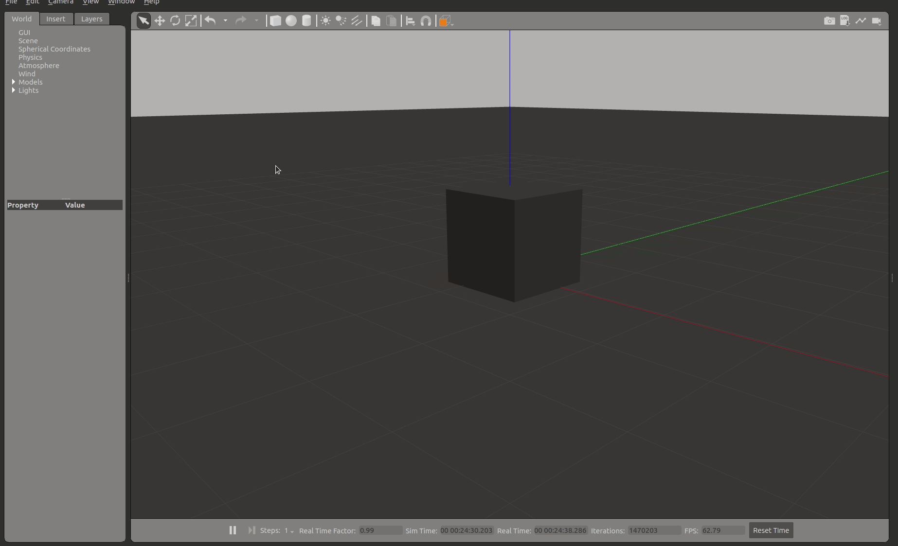
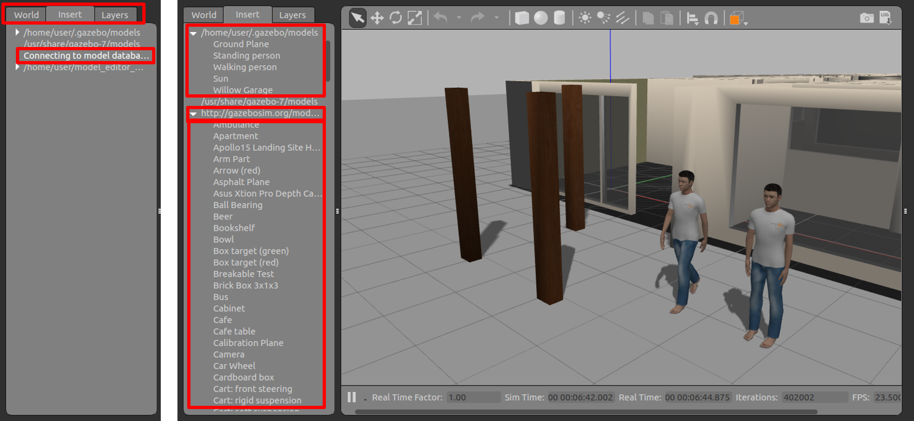

# シミュレータGazeboについて


---

## 1.Gazeboとは
オープンソースの3Dロボットシミュレータの一つ


特徴   

- ROS/ROS2との連携が充実(Open Roboticsが開発)
- ROS2を用いずに単独でも使用可能
- カメラやLiDARなどのセンサシミュレーションが豊富
- 公開されているロボットモデルが豊富
- リアルタイム性を重視
- 物理エンジンの切り替えが可能(ODE(デフォルト),Bullet,Simbody,DART)
- Apacheライセンス

<mark>Gazeboを用いることで実機が無くてもロボットのソフトウェアを開発・検証できます</mark>

今回使用しているGazeboのバージョンは[Gazebo11](https://classic.gazebosim.org/tutorials)でROS1の時代から存在しGazebo Classicと呼ばれています。  
Gazebo Classicはほぼ開発が終了し、2025年1月にサポート終了予定です。  
現在次期バージョンの[Ignition Gazebo](https://gazebosim.org/docs/garden/releases)が開発されています。  
こちらが現在Gazeboという名称を引き継いでおり、今後置き換わって行きます。  
新しいGazeboにもバージョンがあり、ROS2 Humbleと使うにはGazebo Fortressが推奨されています。(推奨以外は余計なエラーが出る可能性が高いです。)


ROS2と連携したシミュレータには、他にも下記があります。  

- Unity
- Unreal Engine
- Webot
- AutowareのAWSIM
- Nvidia Isaac ROS
- Choreonoid

などがあり、フォトメトリックでリッチなシミュレータを使うことができます。

---

## 2.Gazeboを動かしてみる
端末を開き(Ctrl+Alt+T)、下記コマンドを入力
```sh
gazebo
```
Gazeboには多くのGUIツールが用意されている。


---

### サンプルオブジェクト(立方体/球/円柱)の配置
サンプルオブジェクトのGUIを選択し、ワールド上の任意の位置でクリックすることでサンプルオブジェクトを配置できます。


---

### 物体の選択
物体の選択(矢印アイコン)が選択されている状態で、ワールド上の物体をクリックすることで、プロパティなどをの値を確認することができます。

---

### 物体の移動
物体の移動(十字矢印アイコン)が選択された状態で、物体を選択するとx/y/z方向の矢印が出現し、各軸を選択しドラッグすることで特定の軸方向に移動させることができます。上方向に移動させ離すと、物理シミュレータの重力の影響で自由落下をします。
また、地面や他の物体と干渉した場合は反発します。


---

### 物体の回転
物体の回転が選択された状態で、物体を選択するとroll/pitch/yaw方向の回転軸が出現し、各軸を選択しドラッグすることで回転できます。


---

### 物体の伸縮
物体の伸縮が選択された状態で、物体を選択するとx/y/z方向の矢印が出現し、各軸を選択しドラッグすることで大きさを変更することができます。


---

### 選択の解除
物体の選択(矢印アイコン)が選択することで、各操作を解除できます。(Escキーでも可能)

---

### 光のライティング

光のライティングは3種類あります。

- 少し広い範囲を照らす弱い光
- 狭い範囲を照らす強い光
- 全体を照らす強い光



---

### 時刻の再生/停止
下部にある再生/停止アイコンでgazeboの時間を再開・停止することができます。シミュレーション中に複数の障害物を配置したい場合や微調整したい場合などに便利です。


---

### Building Editor
上タブの`Edit`⇒`Building Editor`を選択することで起動できる。オブジェクト作成用のエディタです。部屋の間取りなどを作成する際に簡易に作成が可能です。

基本操作は、`Wall`を選択し、壁の角をクリックすることで作成できます。壁作成を中断する場合はEscキーで中断できます。作成したモデルは`File`⇒`Save`(Ctrl+s)でモデル名を付けて保存ができます。保存場所は~/building_editor_models/以下に保存され、次回起動以降も`Insertタブ`から呼び出し複製することができます。`Building Editor`を終了する場合は`File`⇒`Exit Building Editor`(Ctrl+x)で終了できます。


---

### Model Editor
上タブの`Edit`⇒`Model Editor`を選択することで起動できる。オブジェクト作成用のエディタです。数値を入力して細かい調整が可能です。

基本操作は、サンプルオブジェクトを選択し、右クリックすることで`Inspectorウインドウ`を開き、値を調整できます。`Inspectorウインドウ`には`Link/Visual/Collisionタブ`があります。  
`Linkタブ`では位置などを調整できます。  
`Visualタブ`では見かけ上の大きさや色などを調整できます。  
`Collisionタブ`では当たり判定の大きさなどが調整できます。  
作成したモデルは`File`⇒`Save`(Ctrl+s)でモデル名を付けて保存ができます。
保存場所は`~/model_editor_models/以下`に保存され、次回起動以降も`Insertタブ`から呼び出し複製することができます。`Model Editor`を終了する場合は`File`⇒`Model Editor`(Ctrl+x)で終了できます。


---

### Insertタブ
`Insertタブ`では既存モデルを選択し、ワールド上に配置することができます。インターネット接続があれば、多くのgazeboモデルが用意されているサーバーに接続し、選択できるようになります。(接続には起動後3～5分程度かかります)  
Gazeboモデルを選択するとダウンロードが開始され、少し待つと配置できるようになります。ダウンロードしたモデルは`~/.gazebo/models/以下`に保存され、次回以降はダウンロード待ち時間なしで配置できます(オフラインでも可能)。

- gazeboモデルの事前ダウロード方法
  - Insertタブでダウンロードできるモデルは[osrfのgazebogithub]上にあります。



---

### ワールドを保存する
`File`⇒`Save World`(Ctrl+s)で現在のワールドの状態をファイルに保存できます。ファイルはSDFフォーマットで記述されます。保存時の注意点として、拡張子を入力しないと拡張子なしで保存されるため、拡張子を.worldで保存するのが一般的になっています。

---

### 保存したワールドを呼び出す
起動時のオプションで-O(大文字)を付けることで既存のワールドを呼び出せます。
```sh
gazebo -O worldファイル名
```

---

## 3.Gazeboをlaunchで起動する
Gazeboはgzserverとgzclientの2個で構成されています。

- gzserver：Gazeboワールドを立ち上げるプログラム(物理シミュレーションを行う)
- gzclient：Gazeboワールドをレンダリングして表示するプログラム

上記の通り、gzserverのみでシミュレーションは動くので、レンダリングして表示しなくてもよいなら、gzclientは立ち上げなくてもよいです。計算リソースが厳しい場合は実行しない選択肢もあります。

サンプルのlaunchファイルは、`gazebo_rosパッケージ`内に`gzserver.launch.py`と`gzclient.launch.py`があります。
`gzserver`がワールドを立ち上げるので、worldファイルを読み込ませるのは、`gzserver`になります。
```sh
ros2 launch gazebo_ros gzserver.launch.py world:=worldファイルのパス
```

GUIが必要な場合は、`gzclient`を起動します。
```sh
ros2 launch gazebo_ros gzclient.launch.py
```

---

### gazebo_launch.py
上記のlaunchをまとめたlaunchは下記になります。
```python
#!/usr/bin/env python3
# coding:utf-8
import os

from ament_index_python.packages import get_package_share_directory
from launch import LaunchDescription
from launch.actions import IncludeLaunchDescription
from launch.launch_description_sources import PythonLaunchDescriptionSource

def generate_launch_description():
    pkg_gazebo_ros = get_package_share_directory('gazebo_ros')
    world = os.path.join(
        get_package_share_directory('nav2_bringup'),
        'worlds',
        'willowgarage.world'
    )
    gzserver_cmd = IncludeLaunchDescription(
        PythonLaunchDescriptionSource(
            os.path.join(pkg_gazebo_ros, 'launch', 'gzserver.launch.py')
        ),
        launch_arguments={'world': world}.items()
    )
    gzclient_cmd = IncludeLaunchDescription(
        PythonLaunchDescriptionSource(
            os.path.join(pkg_gazebo_ros, 'launch', 'gzclient.launch.py')
        )
    )

    ld = LaunchDescription()
    ld.add_action(gzserver_cmd)
    ld.add_action(gzclient_cmd)
    return ld
```

---

## 4. ロボットをシミュレーションする(turtlebot3)


次にGazeboでロボットをシミュレーションしてみます。

- 本講習会で扱うROS2の自律走行メタパッケージ`navigation2(nav2)`のチュートリアルではROBOTIS社のturtlebot3というロボットが使用されています。
- turtlebot3ではgazeboのモデルが用意されているためこれを使ってロボットをシミュレーションしてみましょう。
- turtlebot3には3種類のモデルがありますが、今回はwaffleを使用します。

---

### Turtlebot3の関連サイト
- [turtlebot](https://www.turtlebot.com/)
- [ROBOTIS e-Manual: turtlebot3/Quick Start Guide](https://emanual.robotis.com/docs/en/platform/turtlebot3/quick-start/)
- [ROBOTIS e-Manual: turtlebot3/Simulation](https://emanual.robotis.com/docs/en/platform/turtlebot3/simulation/)


---

### turtlebot3のシミュレーション環境のインストール
【0章】の環境構築を行っている場合は不要です。
```sh
# aptでturtlebot3のシミュレーションとnav2関連のインストール
sudo apt -y install ros-humble-gazebo-* ros-humble-cartographer ros-humble-cartographer-ros ros-humble-navigation2 ros-humble-nav2-bringup
sudo apt -y install ros-humble-dynamixel-sdk ros-humble-turtlebot3-msgs ros-humble-turtlebot3 ros-humble-turtlebot3-simulations
# ~/.bashrcにTURTLEBOT3の使用するモデルを選択する設定を追加(端末起動に読み込まれる)(burger,waffle,waffle_piから選択可能)
echo "export TURTLEBOT3_MODEL=waffle" >> ~/.bashrc
# ~/.bashrcにTURTLEBOT3のシミュレーションモデルをGazeboに読み込む設定を追加(端末起動に読み込まれる)
echo "export GAZEBO_MODEL_PATH=$GAZEBO_MODEL_PATH:/opt/ros/humble/share/turtlebot3_gazebo/models" >> ~/.bashrc
```

---

### turtlebot3のシミュレーションの起動
- turtlebot3関連のパッケージはたくさんありますが、シミュレーションを行うパッケージは、`turtlebot3_gazebo`になります。
- Gazeboのworld環境は下記が用意されています。
    - empty_world.world (何もない)
    - turtlebot3_world.world (正六角形の中に1m間隔で9個の円柱)
    - turtlebot3_house.world (模擬住宅環境)
    - turtlebot3_dqn_stage1.world (5m四方の枠)
    - turtlebot3_dqn_stage2.world (5m四方の枠と4個の円柱)
    - turtlebot3_dqn_stage3.world (5m四方の枠と4個の円柱)
    - turtlebot3_dqn_stage4.world (5m四方の枠内に壁が設置)

- 今回は`empty_world.world`を使用するため、launchコマンドで`empty_world.launch.py`を呼び出します。
```sh
ros2 launch turtlebot3_gazebo empty_world.launch.py
# teleop_twist_keyboardで速度指令値を送信し動かしてみる
ros2 run teleop_twist_keyboard teleop_twist_keyboard
```
- Gazeboが起動し、turtlebot3のwaffleモデルが表示されます。
- turtlebot3のwaffleモデルは`/cmd_velトピック`で動作する差動2輪駆動型のロボットになるため、筐体の横に円柱のタイヤが2個ついています。
- 青い円のように見えているものがLaserScanシミュレーション、白い三角柱のように見えているものがカメラシミュレーションになります。


---

### `turtlebot3_gazebo`の`empty_world.launch.py`の詳細
```python title="empty_world.launch.py" linenums="1"
import os

from ament_index_python.packages import get_package_share_directory
from launch import LaunchDescription
from launch.actions import IncludeLaunchDescription
from launch.launch_description_sources import PythonLaunchDescriptionSource
from launch.substitutions import LaunchConfiguration


def generate_launch_description():
    launch_file_dir = os.path.join(get_package_share_directory('turtlebot3_gazebo'), 'launch')
    pkg_gazebo_ros = get_package_share_directory('gazebo_ros')

    use_sim_time = LaunchConfiguration('use_sim_time', default='true')
    x_pose = LaunchConfiguration('x_pose', default='0.0')
    y_pose = LaunchConfiguration('y_pose', default='0.0')

    world = os.path.join(
        get_package_share_directory('turtlebot3_gazebo'),
        'worlds',
        'empty_world.world'
    )

    gzserver_cmd = IncludeLaunchDescription(
        PythonLaunchDescriptionSource(
            os.path.join(pkg_gazebo_ros, 'launch', 'gzserver.launch.py')
        ),
        launch_arguments={'world': world}.items()
    )

    gzclient_cmd = IncludeLaunchDescription(
        PythonLaunchDescriptionSource(
            os.path.join(pkg_gazebo_ros, 'launch', 'gzclient.launch.py')
        )
    )

    robot_state_publisher_cmd = IncludeLaunchDescription(
        PythonLaunchDescriptionSource(
            os.path.join(launch_file_dir, 'robot_state_publisher.launch.py')
        ),
        launch_arguments={'use_sim_time': use_sim_time}.items()
    )

    spawn_turtlebot_cmd = IncludeLaunchDescription(
        PythonLaunchDescriptionSource(
            os.path.join(launch_file_dir, 'spawn_turtlebot3.launch.py')
        ),
        launch_arguments={
            'x_pose': x_pose,
            'y_pose': y_pose
        }.items()
    )

    ld = LaunchDescription()

    # Add the commands to the launch description
    ld.add_action(gzserver_cmd)
    ld.add_action(gzclient_cmd)
    ld.add_action(robot_state_publisher_cmd)
    ld.add_action(spawn_turtlebot_cmd)

    return ld
```


- `empty_world.launch.py`では、`gzserver`,`gzclient`の他に以下の2個のlaunchファイルを呼び出し、2個のノードを起動しています。
  - `robot_state_publisher.launch.py`
    - パッケージ名:`robot_state_publisher`
    - ノード名:`robot_state_publisher`
    - urdfファイル読込、静的位置関係の`/tf_staticトピック`とrviz上にロボットモデルを表示するための`/robot_descriptionトピック`を出力
    - `/joint_statesトピック`(今回はタイヤの回転状態)をサブスクライブし動的位置関係の`/tfトピック`を出力
    - urdfファイルパス:`/opt/ros/humble/share/turtlebot3_gazebo/urdf/turtlebot3_waffle.urdf`
  - `spawn_turtlebot3.launch.py`
    - パッケージ名:`gazebo`
    - ノード名:`spawn_entity.py`
    - sdfファイル(urdfファイル)を読込、gazebo上にturtlebot3のwaffleモデルを配置し、ノードを終了
    - sdfファイルパス:`/opt/ros/humble/share/turtlebot3_gazebo/models/turtlebot3_waffle/model.sdf`
- turtlebot3のwaffleモデルには、筐体モデルの他に差動2輪制御コントローラや複数のセンサシミュレーションのgazebo_pluginsが記述され、ROS2ノードとして動作しています。(`ros2 node list`で確認できます)
  - 差動2輪制御コントローラ
    - ノード名:`/turtlebot3_diff_drive`
    - gazeboプラグイン名:`libgazebo_ros_diff_drive.so`
  - 車輪の回転状態シミュレーション
    - ノード名:`/turtlebot3_joint_state`
    - gazeboプラグイン名:`libgazebo_ros_joint_state_publisher.so`
  - 2DLiDARシミュレーション
    - ノード名:`/turtlebot3_laserscan`
    - gazeboプラグイン名:`libgazebo_ros_ray_sensor.so`
  - カメラシミュレーション
    - ノード名:`/camera_driver`
    - gazeboプラグイン名:`libgazebo_ros_camera.so`
  - IMUシミュレーション
    - ノード名:`/turtlebot3_imu`
    - gazeboプラグイン名:`libgazebo_ros_imu_sensor.so`
- gazeboプラグインの種類に関してはgazeboのチュートリアルページやgazebo_pluginsのgithubの実装で確認できます。
  - [gazeboのチュートリアルページ](https://classic.gazebosim.org/tutorials?cat=connect_ros)
  - [gazebo_ros_pkgsのgazebo_plugins](https://github.com/ros-simulation/gazebo_ros_pkgs/tree/galactic/gazebo_plugins/src)

---


### turtlebot3のシミュレーションのノード構成
現在の状態は下記の図のようになります。(講習会ではあまり使用しないためカメラとIMUのシミュレーションは図から省略しています)


- 図の赤枠部分が自律走行を行っていく上で重要な部分になります。
- 入力部分(サブスクライバ)は`/cmd_velトピック`となっているため、【1章】で行った速度指令値出力で動かすことができます。

```sh
# ros2 topic pubコマンドの場合
ros2 topic pub --once /cmd_vel geometry_msgs/msg/Twist "{linear: {x: 0.25, y: 0.0, z: 0.0}, angular: {x: 0.0, y: 0.0, z: 0.5}}"

# teleop_twist_keyboardの場合
ros2 run teleop_twist_keyboard teleop_twist_keyboard 

# joy + teleop_twist_joyの場合
ros2 run joy joy_node
ros2 run teleop_twist_joy teleop_node 
```

---


## Gazeboの概要まとめ
- Gazeboはオープンソースの3Dロボットシミュレータで、ROS2から独立したソフトウェアです。
- ROS2との連携や、ロボットモデルやセンサシミュレーションが豊富に揃っています。
- Gazeboを用いることで実機が無くてもロボットのソフトウェアを開発・検証できます。
- Gazeboはシミュレーションを行う`gzserver`と環境の描画(レンダリング)を行う`gzclient`の2個から構成されています。
- ロボット(turtlebot3)のシミュレーションを動作させる方法を解説しました。
- このあとからはこれをベースにROS2ツールやnavigation2について解説していきます。

---

## ロボットモデルを自作するための参考サイト
- [nav2のSetting Up The URDFチュートリアル](https://navigation.ros.org/setup_guides/urdf/setup_urdf.html)
- [nav2のSimulating an Odometry System using Gazeboチュートリアル](https://navigation.ros.org/setup_guides/odom/setup_odom.html#simulating-an-odometry-system-using-gazebo)
- [nav2のSimulating Sensors using Gazeboチュートリアル](https://navigation.ros.org/setup_guides/sensors/setup_sensors.html#simulating-sensors-using-gazebo)

差動2輪のロボットモデルであれば、下記のような円柱と球だけで作成することができるため、URDFの記述量も多くはなりません。  
自作のロボットモデルであればセンサ構成等も自由に配置できるため、一度作成してみることをオススメします。

