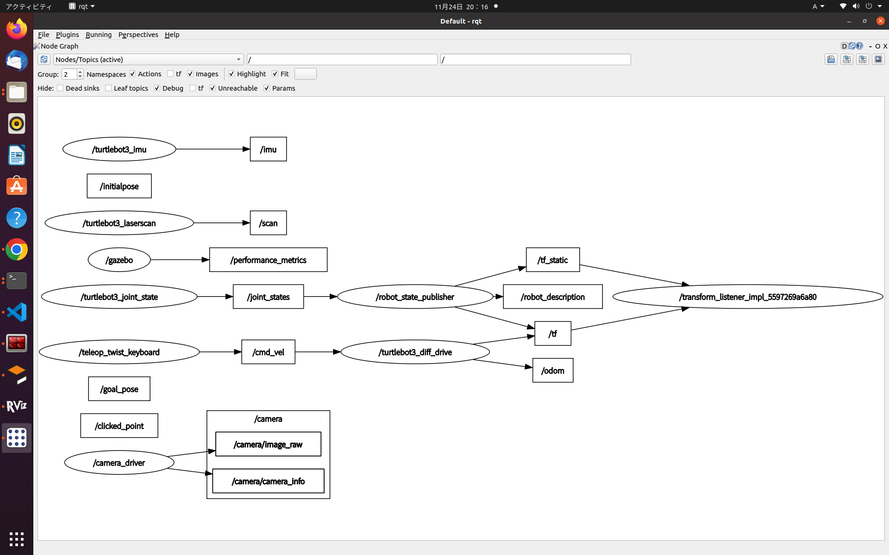
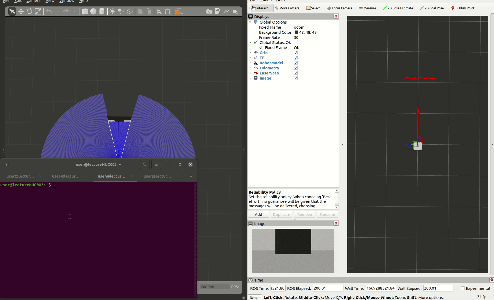
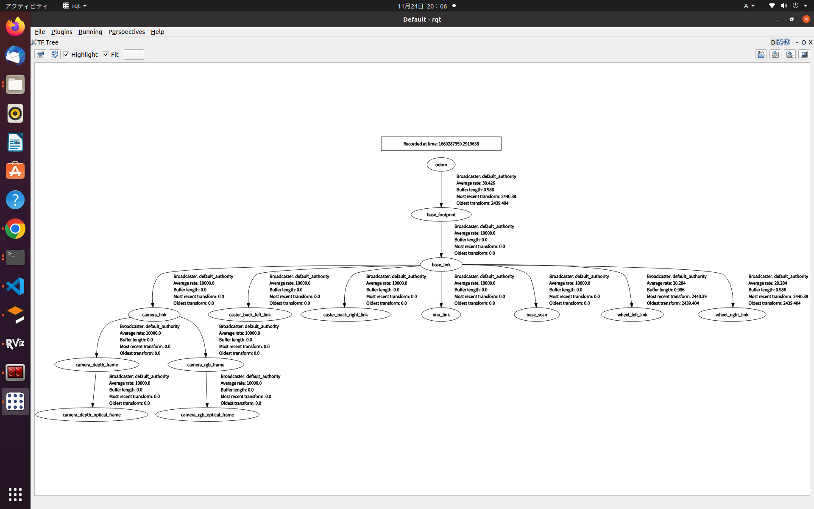

# ROS2のGUIツールrqtについて
ROS2はCUI操作が基本ですが、GUIツールも用意されています。  
ROS2のGUIツールの使い方を学びましょう。  


---

## RQtとは
- GUIツールキットQtを用いたROS2のGUI開発ツール  
- ノードの接続関係やパラメータ調整、ログの確認、座標関係の可視化が便利
- rqtには多くのプラグイン(30種類以上)があり自作することも可能

[Qtのwiki](https://ja.wikipedia.org/wiki/Qt)

よく使用するプラグインを紹介します。

- rqt_graph  
    ノードとトピックの接続関係を可視化
    ```sh
    rqt_graph #短縮形
    ros2 run rqt_graph rqt_graph
    ``` 
- rqt_reconfigure  
    動的なパラメータ変更や確認が可能(ros2から全パラメータが標準で見えるようになった)
    ```sh
    ros2 run rqt_reconfigure rqt_reconfigure
    ``` 
- rqt_tf_tree  
    TFのツリー構造の可視化
    ```sh
    ros2 run rqt_tf_tree rqt_tf_tree
    ``` 
- rqt_topic  
    現在流れているトピックの中身を確認できる
    ```sh
    ros2 run rqt_topic rqt_topic
    ``` 
- rqt_console  
    各ノードが出力しているログをGUIで確認できる(ノードが多くなってきたときのデバッグに便利)
    ```sh
    ros2 run rqt_console rqt_console
    ``` 
下記のコマンドでrqt本体を呼び出し、上タブのPluginsからも呼び出し可能です。  
Pluginsから開いたものはRunningタブから終了するまでは開いたままになります。  
また、画面構成を保持して置けるため、自由なレイアウトも可能です。
```sh
rqt
```

---

## rqtを使ってみる
gazeboで起動したturtlebot3シミュレーションのノード構成とTFツリーをrqtで可視化してみましょう。
```sh
# turtlebot3シミュレーションのempty_worldの起動
ros2 launch turtlebot3_gazebo empty_world.launch.py
```

---

### turtlebot3シミュレーションのノード構成の可視化
```sh
rqt_graph
```


表示の切り替え方法は下記になります。


---

### turtlebot3シミュレーションのtfツリーの可視化
```sh
ros2 run rqt_tf_tree rqt_tf_tree
``` 




GUIで可視化するほうがデバッグ効率が良いことが多いので、積極的に使っていきましょう。