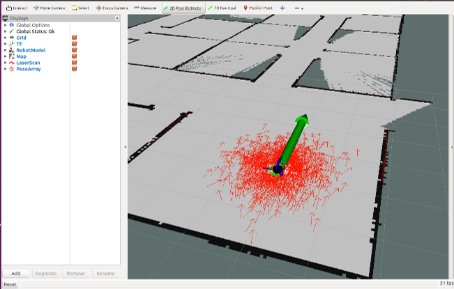
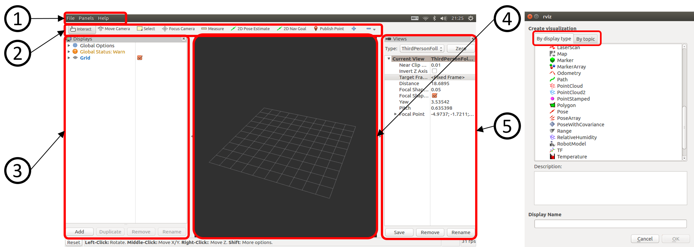
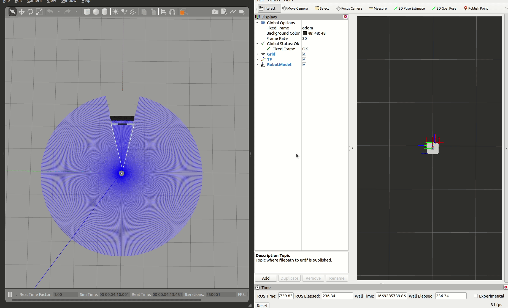

# 3D可視化ツールRvizについて


---

## 1.Rviz(3D可視化ツール)とは
RvizとはROS2の3次元可視化ツールで、ロボット位置(座標)やセンサ値(点群・画像など)を3次元的に確認することができます。  
このツールのおかげで、OpenCVやOpenGL,gnuplotなどを用いて作成していた可視化のためのプログラミングが大幅に削減されます。  
プラグインという形式で表示方法を拡張することも可能です。



---

## 2.Rvizの起動方法
RvizはROS2パッケージになっており、`rviz2パッケージ`の`rviz2ノード`が本体になります。
```sh
ros2 run rviz2 rviz2
```
省略したコマンドでも起動できるのでこちらを使用することが多いです。
```sh
rviz2
```
起動すると下記のようなウインドウが立ち上がります。



---

## 3.Rvizの画面構成
- ①メニュー(Menu)  
    ディスプレイの状態の記録や呼び出しを行う
- ②ツール(Tools)  
    2Dナビゲーションの位置推定(2D Pose Estimate)や、目標位置設定(2D Nav Goal)など様々な機能を持ったツールを実行する
- ③ディスプレイ(Displays)  
    表示したいトピックの選択や3D Viewに表示する設定を変更する。  
    下部のAddボタンで右のウインドウに3Dビューに表示可能なオブジェクト一覧が表示され、表示するトピックの選択を行う。また表示しているオブジェクトはRemoveで削除や、Renameで表示名が変更できる。  
      - By display type：表示できるオブジェクトの一覧  
      - By Topic：配信されているトピックの一覧  
    
- ④3Dビュー(3D View)  
    様々なデータを3次元表示するメイン画面。  
    マウスのドラッグ操作(左:回転,ホイール:並進,右:拡大縮小)で視点変更できる  
- ⑤ビュー(View)  
    視点をロボットに追従させるなどの3Dビューの視点設定を行う  
    `Current View`の`Target Frame`にtfフレーム名を記述することでそのフレームに追従したカメラ制御が行えます。  

--- 

## 4.Rvizの設定ファイル保存
①メニューの`File`⇒`Save Config As`でrvizの現在の状態を`rvizファイル`に保存できます。  
.rvizファイルはパッケージ内に配置する場合、慣例としてパッケージ直下のrvizディレクトリ以下に配置します

---

## 5.Rvizの設定ファイル読み込み
`rvizファイル`を読み込むには、rvizを起動後に`File`⇒`Open Config`で読み込むか、起動時の<mark>-dオプション</mark>で`rvizファイル`を読み込む方法があります。

```sh
rviz2 -d rvizファイルパス
```

`ros2 run`起動の場合も同様に<mark>-dオプション</mark>で可能です。
```sh
ros2 run rviz2 rviz2 -d rvizファイルパス
```
<mark>-dオプション</mark>で指定しない場合は、~/.rviz2/default.rvizが呼び出されます。  

---

## launchでの起動方法(python,xml,yaml)

### rviz2_launch.py
```bash
ros2 launch rviz2_launch.py
```
```python
from launch import LaunchDescription
from launch_ros.actions import Node
def generate_launch_description():
    rviz2_node = Node(
        package='rviz2',
        executable='rviz2',
        name='rviz2',
        arguments=['-d', '/home/user/.rviz2/default.rviz'],
    )
    ld = LaunchDescription()
    ld.add_action(rviz2_node)
    return ld
```
### rviz2_launch.xml
```bash
ros2 launch rviz2_launch.xml
```
```xml
<?xml version="1.0"?>
<launch>
    <node pkg="rviz2" exec="rviz2" name="rviz2" args="-d /home/user/.rviz2/default.rviz"/>
</launch>
```
### rviz2_launch.yaml
```bash
ros2 launch rviz2_launch.yaml
```
```yaml
launch:
- node:
    pkg: "rviz2"
    exec: "rviz2"
    name: "rviz2"
    args: "-d /home/user/.rviz2/default.rviz"
```

---

## turtlebot3シミュレーションをRvizで可視化する


- gazeboの項で使用したturtlebot3シミュレーションをRvizで可視化する手順を通して使い方を学びます。
- turtlebot3シミュレーションを起動します。(すでに起動している場合は不要です)
- LiDARのシミュレーションも可視化するので、turtlebot3シミュレーションの起動後、前方2,3m付近に立方体を配置して進めていきます。
```sh
# turtlebot3シミュレーションの起動
ros2 launch turtlebot3_gazebo empty_world.launch.py
# teleop_twist_keyboardで速度指令値を送信し動かしてみる
ros2 run teleop_twist_keyboard teleop_twist_keyboard
```
- Rvizを起動します
```sh
rviz2
```

---

### TF(座標関係)の可視化
- Rvizで可視化するためには、どの座標を基準に可視化するかを設定しなければなりません。
- RvizはTFライブラリを使用しているため基準座標の入力にフレームIDを使用します。
- このフレームIDを`Displays`にある`Global Options`の項目`Fixed Frame`に入力することで、その座標を基準に可視化するという設定ができます。
- turtlebot3シミュレーションでは`odom→base_footprint→base_link→base_scan`という`tf(/tf,/tf_static)トピック`を出力しています。
- `Fixed Frame`に`odom`を設定し`odomフレーム`(オドメトリの原点座標)を基準に座標関係を可視化します。
- `Displays`の`Addボタン`をクリックし、`By display typeタブ`内にある`TF`を選択して`OKボタン`をクリックします。
- 重なって見えづらいですが、赤が+X、緑が+Y、青が+Z方向を表す座標系が表示されます。


---

### ロボットモデルの可視化
- Rviz上でロボットモデルを可視化するには、`By display typeタブ`内にある`RobotModel`を使用します。
- 追加後、プルダウンを開き`Description Topic`に`robot_state_publisherノード`が出力している`robot_description`を記述します。
- Gazebo上のモデルと同じものが表示されます。


---

### オドメトリ(移動量の積算値)の可視化
- `/odom [nav_msgs/msg/Odometry]トピック`を可視化します。
- `By topicタブ`内から`/odom`を選択します。
- シミュレーションではCovariance(共分散)が適切に出力されていないため、黄色くなり邪魔なので表示をOFFにします。
- デフォルトではKeepが100に設定され100個分の姿勢を表す矢印が表示されるので、最新のみ表示する場合は1に設定します。


---

### 2DLiDARの可視化
- `/scan [sensor_msgs/msg/LaserScan]トピック`を可視化します。
- `By topicタブ`内から`/scan`を選択します。
- デフォルトではサブスクライバ側のRvizのQoSポリシーが`Reliable`で、パブリッシャ側の`/scan`が`Best Effort`で出力されているため、接続が確立できず表示できません。
- プルダウン内の`Topic`の`Reliability Policy`を`Best Effort`に変更することで表示できます。
- 表示タイプとサイズを変更できます。(おすすめはPointタイプで、ピクセル単位で表示されるため、カメラを拡大縮小しても表示サイズが変わらなくなります。)


---

### カメラ画像の可視化
- `/camera/image_raw [sensor_msgs/msg/Image]トピック`を可視化します。
- `By topicタブ`内から`/camera/image_raw`の`image`を選択します。
- `/scan`と同様に`Topic`の`Reliability Policy`を`Best Effort`に変更することで表示できます。


---

## QoSについて
- ROS2ではQoSによってトピック通信の信頼性(Reliability)や耐久性(Durability)が細かく制御できるようになりました。
- Reliabilityは下記の2種類が設定できます。
  - Best Effort：サンプルの配信を試みますが、ネットワークが堅牢でないとサンプルを失う可能性があります。
  - Reliable：サンプルが配達されることを保証します。場合のよっては複数回再試行します。
- Durabilityは下記の2種類が設定できます。
  - Transient local：パブリッシャは「遅れて参加する」サブスクライバのサンプルを待ちます。(最後の出力を保持するROS1でlatch topicと呼ばれていた挙動)
  - Volatile：上記のようなサンプルを待ちません。
- <mark>しかし、Rvizでの表示のようにトピック名とメッセージ型が一致しているがトピック通信接続ができないQoSの組み合わせがありますので気をつけましょう。</mark>

---

### QoS Reliability プロファイルの互換性
|パブリッシャ(Offerer側)|サブスクライバ(Request側)|接続可否|接続結果|備考|
|-|-|-|-|-|
|Best effort|Best effort|OK|Best effort|
|Best effort|Reliable|<mark>NG</mark>|なし|
|Reliable|Best effort|OK|Best effort|ネットワークによっては 抜けが発生|
|Reliable|Reliable|OK|Reliable|

---

### QoS Durabiity プロファイルの互換性

|パブリッシャ(Offerer側)|サブスクライバ(Request側)|接続可否|接続結果|備考|
|-|-|-|-|-|
|Volatile|Volatile|OK|Volatile|
|Volatile|Transient local|<mark>NG</mark>|なし|
|Transient local|Volatile|OK|Volatile|latchにできないので注意|
|Transient local|Transient local|OK|Transient local|

---

### QoSについての参考サイト
- [ROS 2のQoS (Quality of Service) を試す](https://www.youtalk.jp/2017/05/30/ros2-qos.html)
- [【ROS 2】QoS 設定について（公式文書和訳）
](https://www.moriken254.com/entry/2019/05/06/171237)

---