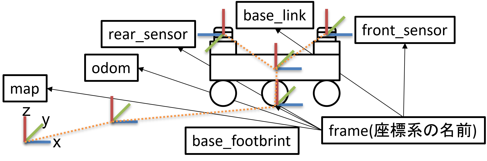

# 座標管理ライブラリTFについて
ロボットのソフトウェアでは多数の座標系を扱います。  
異なる座標系の情報を扱う場合、座標変換が必要になります。  
ROS2では座標系を管理するライブラリTFを用いて一括管理しています。  
可視化ツールであるRvizや自律走行パッケージのnavigation2はTFライブラリに依存しており、上手く扱うためにはTFの理解が必須です。  
このTF扱い方について学びましょう。

---

## TFの概要
ROS2の便利な座標管理モジュールであるTFは、「ある座標系」と「他の座標系」の位置関係をツリー構造で管理しています。

自律走行では、地図座標やオドメトリ座標、ロボット中心座標やセンサ中心座標など様々な座標系を扱います。  
一般的なROS2における自律走行では、座標系を下記の図のように`map`→`odom`→`base_footprint`→`base_link`→`sensor`というTFツリーで表します。  



各座標系の名前はframe(フレーム)と呼ばれ、上位のframe(親フレーム)は1つのみで、下位のframe(子フレーム)は複数というルールの上で数珠つなぎに接続されています。

この構造のおかげで、バグの温床になる可能性の高い座標変換計算が、変換元のフレーム名と変換先のフレーム名をTFライブラリに入力するだけで、自動計算されます。

例えばmap座標系から見たfront_sensorの位置などを簡単に取得できます。

TFはトピックとして扱われますが、実態はサーバーのようなものがあり、各ノードが出力するTFをつなぎ合わせて一括管理しています。  
出力されたTFには時刻情報があり、座標変換に使っても良いかを時間で判断しています。

ROS2にあるSLAMや自律走行パッケージは、このTFを入力として受け取るものが多いので、そのパッケージがどのようなTF構造を入力として受け取るのかを把握しておく必要があります。

---

## TFの出力方法
TFには静的な位置関係(tf_static)と動的な位置関係(tf)の2種類があります。

静的な位置関係とは、ロボットに固定されているセンサなどの位置関係が変わらないもののことを指します。

また、動的な位置関係とは、時々刻々と位置関係が変化するもののことを指します。

---

### 静的な位置関係を出力する方法
下記の2種類があります。

- ①. gazeboで使用していた`URDFファイル`と`robot_state_publisherノード`を用いる方法
- ②. `tf2_rosパッケージ`の`static_transform_publisherノード`を用いる方法

下記の例では`base_link`→`laser`の静的な位置関係を`static_transform_publisherノード`で記述しています。

```py
# launch内でのstatic_transform_publisherノードの使い方
# base_link -> laser tf2 staticノード設定
base_link_laser = Node(
    package = 'tf2_ros',
    executable = 'static_transform_publisher',
    name = 'base_link_laser',
    arguments=[
        '--x', '0.10', '--y', '0', '--z', '0.18', 
        '--yaw', '0', '--pitch', '0', '--roll', '0', 
        '--frame-id', 'base_link', '--child-frame-id', 'laser'
    ],
)
```

URDFの記述が苦でなければ、シミュレーションモデルと同様に記述できる為便利です。
簡便なのはlaunchファイルに直接書き込める②のほうかと思います。

---

### 動的な位置関係を出力する方法
下記の2種類があります。

- ①. ソースコード内で`tf2_ros::TransformBroadcaster`を用いる方法
- ②. `URDFファイル`と`joint_state_publisherノード(sensor_msgs/msg/JointState型を配信する)`を用いる方法

プログラミングになるので、本講習では時間の都合上取り扱いませんが、  
launchシステムと同様に、非常に便利かつ重要なないようであるので、下記の本家チュートリアルを行うことを推奨します。  
[ROS2のTFに関する本家チュートリアル](https://docs.ros.org/en/humble/Tutorials/Intermediate/Tf2/Tf2-Main.html)

---

## TFの確認方法
TFがうまく接続されているかの確認には`rqt_tf_tree`を使用するのが簡便です。
```sh
ros2 run rqt_tf_tree rqt_tf_tree
``` 
