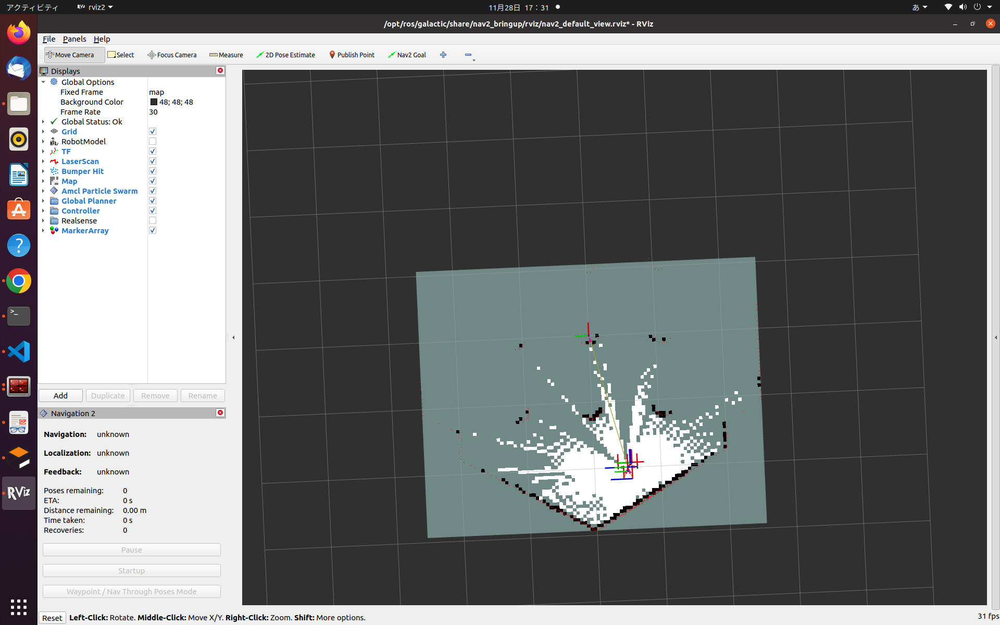
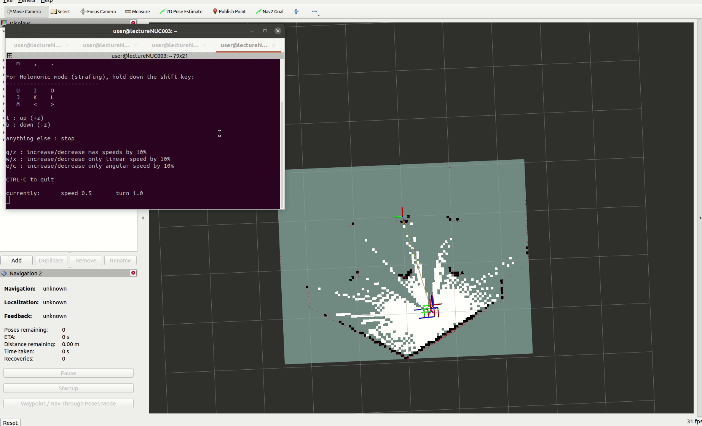
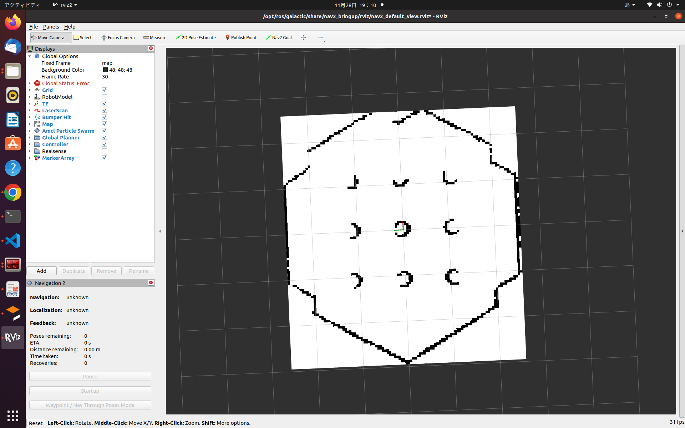
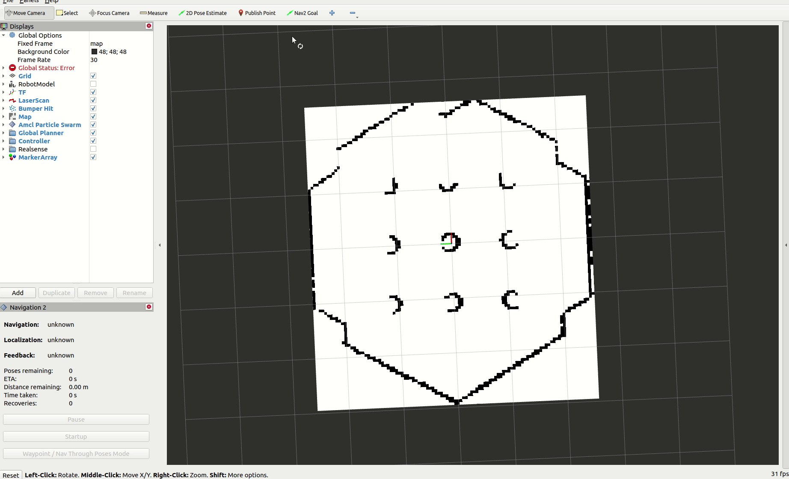
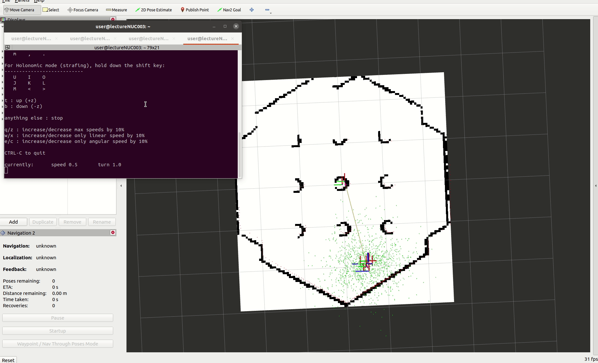
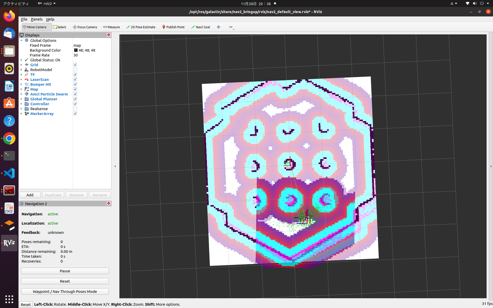
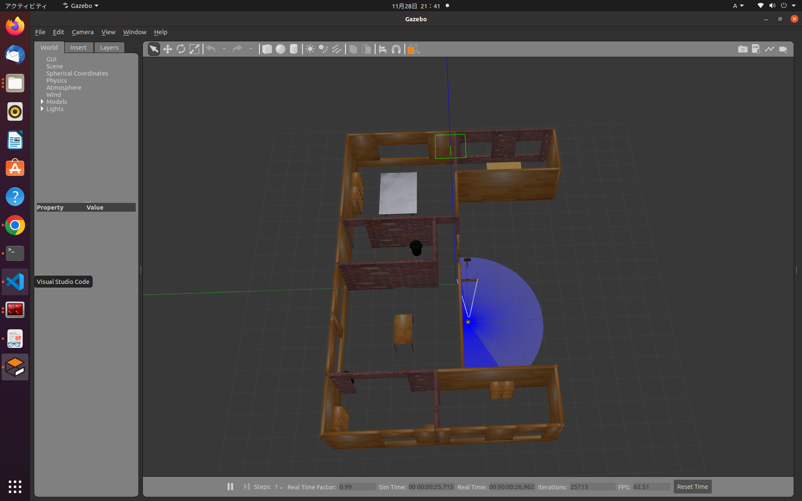

# シミュレータ上で地図作成と自律走行を動かしてみる

まずは、turtlebot3シミュレーションでROS2の地図作成と自律走行を動かしてみましょう。  

手順としては下記になります。  
1.SLAMで地図を作成する  
2.地図を保存する  
3.地図を読み込み、自己位置推定をする  
4.自己位置推定をしながら自律走行する  

使用するlaunchファイルがあるパッケージは下記です。

- turtlebot3_gazebo
- nav2_bringup
- slam_toolbox  


インストールした時点で地図作成と自律走行を動かすためのlaunchファイルは`/opt/ros/humble/share/[パッケージ名]/launch/ディレクトリ`にあります。(pixi環境の場合は`$PIXI_PROJECT_ROOT/.pixi/envs/default/share/[パッケージ名]/launch/ディレクトリ`)  
 

---

## シミュレータ上で地図作成(SLAM)を動かしてみる
turtlebot3シミュレーションとrivzを起動します。  
さらに`nav2_bringupパッケージ`の`slam_launch.py`に`use_sim_time:True`の引数を与えて起動します。  
`use_sim_time:True`はシミュレーション時間を使用するという意味で、実機の場合には`False`にします。  
launchファイルの引数に何が指定できるかは、`ros2 launch [パッケージ名] [launchファイル名] -s`で確認できます。  
```sh
# turtlebot3シミュレーションをturtlebot3_worldで起動
ros2 launch turtlebot3_gazebo turtlebot3_world.launch.py
# Rviz2(navigation2の設定済み)を起動
ros2 launch nav2_bringup rviz_launch.py
# SLAMの起動(slam_toolboxパッケージ)
ros2 launch nav2_bringup slam_launch.py use_sim_time:=True
```
起動に成功するとrvizは下記のようになります。



速度指令をパブリッシュして地図を作成しましょう。

```sh
# キーボードで操作
ros2 run teleop_twist_keyboard teleop_twist_keyboard
```



---

## 地図作成(SLAM)で作成した地図を保存する
navigation2で地図を保存するにはmap_serverパッケージを用います  

- map_serverパッケージには地図保存の方法が2種類提供されています
    - map_saver_cliノード  
      `-f [保存先パス]`オプションで任意名で保存ができます。
      ```sh
      ros2 run nav2_map_server map_saver_cli -f map
      ```
    - map_saver_serverノード
      ```sh
      # 今回はslam_launch.py内で立ち上げているので下記は不要
      # ros2 run nav2_map_server map_saver_server
      # ros2 lifecycle set /map_saver 1
      # ros2 lifecycle set /map_saver 3
      # サービスコマンドで地図保存ができます
      ros2 service call /map_saver/save_map nav2_msgs/srv/SaveMap "{map_topic: map, map_url: map, image_format: pgm, map_mode: trinary, free_thresh: 0.25, occupied_thresh: 0.65}"
      ```

上記のどちらかを実行すると、`map.yaml`と`map.pgm`が作成されます。  
この`pgmファイル`と`yamlファイル`がROS2での自律走行の地図になります。  
詳細については補足資料で説明しますが、`pgmファイル`が占有格子地図の各グリッドの値を画像ファイルとして持ち、`yamlファイル`が原点座標などの設定値を持っています。  


```yaml
# map.yaml
image: map.pgm
mode: trinary
resolution: 0.05
origin: [-2.95, -2.57, 0]
negate: 0
occupied_thresh: 0.65
free_thresh: 0.25
```

ここまでで、1度すべての端末を終了します。

---

## シミュレータ上で自己位置推定を動かしてみる
先ほど保存した地図上で自己位置推定(地図上での自分の位置を推定する)を動かしてみましょう。  

turtlebot3シミュレーションとrivzを再度起動します。  
さらに`nav2_bringupパッケージ`の`localization_launch.py`に`map:=[マップのyamlファイルパス]`と`use_sim_time:=True`の引数を与えて起動します。  
```sh
# turtlebot3シミュレーションをturtlebot3_worldで起動
ros2 launch turtlebot3_gazebo turtlebot3_world.launch.py
# Rviz2(navigation2の設定済み)を起動
ros2 launch nav2_bringup rviz_launch.py
# 自己位置推定の起動
ros2 launch nav2_bringup localization_launch.py map:=map.yaml use_sim_time:=True
```

起動すると下記のような状態でまだ初期位置が与えられていない状態になっています。



Rviz2のツールにある<mark>2DPopseEstimate</mark>で初期位置を与えてみましょう。
<mark>2DPopseEstimate</mark>をクリックして、初期位置付近をクリック&ドラッグで、位置と向きを指定します。



この時、<mark>2DPopseEstimate</mark>は`/initialposeトピック`を出力しています。

なので、コマンドで`/initialposeトピック`を出力することでも初期位置を設定できます。
```sh
ros2 topic pub /initialpose geometry_msgs/msg/PoseWithCovarianceStamped "{header: {stamp: {sec: 0}, frame_id: 'map'}, pose: {pose: {position: {x: -2.0, y: -0.5, z: 0.0}, orientation: {w: 1.0}}}}" -1 
```

初期位置が設定されるとTFと赤い点でLaserScan、緑矢印で自己位置推定のパーティクルフィルタ(粒子フィルタ)の値が可視化されます。

速度指令をパブリッシュして緑矢印の自己位置推定のパーティクルの動きを観察しましょう。

```sh
# キーボードで操作
ros2 run teleop_twist_keyboard teleop_twist_keyboard
```
ロボットの動きに合わせてパーティクルの位置が更新されていきます。




---

## シミュレータ上で自律走行を動かしてみる
自己位置推定ができたので、続けて自律走行を動かしまししょう。  
`nav2_bringupパッケージ`の`navigation_launch.py`に`use_sim_time:=True`の引数を与えて起動します。  

```sh
# 自律走行の起動
ros2 launch nav2_bringup navigation_launch.py use_sim_time:=True
```

起動すると下記のような色の<mark>コストマップ</mark>と呼ばれるものが表示されます。

コストマップは地図全体のコストを表し、大域的な経路計画に使用される`global_costmap`とロボット周辺のコストを表し、局所的な経路計画に使用される`local_costmap`の2種類あります。

表示されているコストマップの色は、観測点(障害物)がピンク色で、その周囲に水色の衝突エリア(ロボットがその座標に行くと障害物に当たってしまう)、さらに、赤→紫→青→白の順に障害物との距離に応じて、コストが低くなるように表示されています。


それでは、Rviz2のツールにある<mark>Nav2 Goal</mark>でゴール座標を与えて動かしてみましょう。

動かし方は<mark>2DPopseEstimate</mark>と同様です。


経路が計画され、経路に沿ってロボットが移動すれば成功です。

また、ゴールを障害物上に設定した場合には、失敗します。

他にも左下の<mark>Navigation2ツール</mark>を使用して、<mark>Waypoints Navigation</mark>や<mark>Path Through Navigation</mark>を行うことができます。

Waypoints Navigation(順番にWaypointへ移動します)


Path Through Navigation(Wapointを全て繋げた経路を生成して移動します)


また、裏でGazeboが動いていますので、追加の障害物を置くことも可能です。


---

## シミュレータ上で地図作成(SLAM)中に自律走行(explore)を動かしてみる
また、自己位置推定中に自律走行が動かせたので、SLAM中にも自律走行が動かせます。(SLAMは自己位置推定中に地図作成しているので)

一度全ての端末を終了して下記を実行してみましょう。

```sh
# turtlebot3シミュレーションをturtlebot3_worldで起動
ros2 launch turtlebot3_gazebo turtlebot3_world.launch.py
# Rviz2(navigation2の設定済み)を起動
ros2 launch nav2_bringup rviz_launch.py
# SLAMの起動(slam_toolboxパッケージ)
ros2 launch nav2_bringup slam_launch.py use_sim_time:=True
# 自律走行の起動
ros2 launch nav2_bringup navigation_launch.py use_sim_time:=True
```


今回は`turtlebot3_world`を使用しましたが、他に用意されている`turtlebot3_house`を使用するともう少し広い空間で行うことができますし、自作Worldでも可能です。
```sh
# turtlebot3シミュレーションをturtlebot3_houseで起動
ros2 launch turtlebot3_gazebo turtlebot3_house.launch.py
```



自律走行の簡易的な手順は、地図を作成して保存し、地図上で自己位置推定を行いながら自律走行ような手順になります。  
以上でシミュレータ上で地図作成と自律走行を動かしてみるは終了です。 

