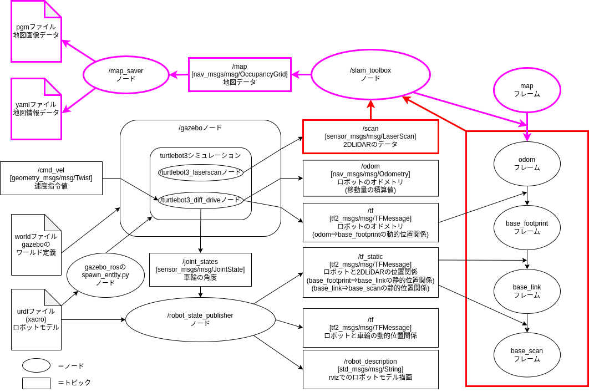

# 地図作成(SLAM)の入出力について

地図作成(SLAM)の入出力は下記の図のようになっています。  
`/slam_toolboxノード`は、`/scanトピック`と`/tfトピック(odom〜base_scanフレーム)`をサブスクライブし、`/mapトピック`と`/tfトピック(map→odom)`を出力します。  
SLAMのアルゴリズムでは計算上`/tfトピック(map→base_footprint)`が得られますが、TFのルール上、親フレームが1つでなければならないことと、自己位置推定の際に後述する理由で、`(map→base_footprint)`と`(odom→base_footprint)`のベクトルの引き算により、`(map→odom)`を出力しています。
`/map_saverノード`は、`/mapトピック`をサブスクライブし、地図データとして`pgmファイル`と`yamlファイル`を出力しています。



---

## slam_launch.pyの内容

slam_launch.pyでは、`map_saver_serverノード`と`slam_toolbox(online_async_launch)ノード`を起動しています。

```py
# slam_launch.py 
import os

from ament_index_python.packages import get_package_share_directory

from launch import LaunchDescription
from launch.actions import DeclareLaunchArgument, IncludeLaunchDescription
from launch.conditions import IfCondition, UnlessCondition
from launch.launch_description_sources import PythonLaunchDescriptionSource
from launch.substitutions import LaunchConfiguration
from launch_ros.actions import Node
from nav2_common.launch import HasNodeParams, RewrittenYaml


def generate_launch_description():
    # Input parameters declaration
    namespace = LaunchConfiguration('namespace')
    params_file = LaunchConfiguration('params_file')
    use_sim_time = LaunchConfiguration('use_sim_time')
    autostart = LaunchConfiguration('autostart')
    use_respawn = LaunchConfiguration('use_respawn')
    log_level = LaunchConfiguration('log_level')

    # Variables
    lifecycle_nodes = ['map_saver']

    # Getting directories and launch-files
    # bringup_dir = get_package_share_directory('nav2_bringup')
    bringup_dir = get_package_share_directory('lecture_nav2_bringup')
    slam_toolbox_dir = get_package_share_directory('slam_toolbox')
    slam_launch_file = os.path.join(slam_toolbox_dir, 'launch', 'online_async_launch.py')

    # Create our own temporary YAML files that include substitutions
    param_substitutions = {
        'use_sim_time': use_sim_time}

    configured_params = RewrittenYaml(
        source_file=params_file,
        root_key=namespace,
        param_rewrites=param_substitutions,
        convert_types=True)

    # Declare the launch arguments
    declare_namespace_cmd = DeclareLaunchArgument(
        'namespace',
        default_value='',
        description='Top-level namespace')

    declare_params_file_cmd = DeclareLaunchArgument(
        'params_file',
        default_value=os.path.join(bringup_dir, 'params', 'nav2_params.yaml'),
        description='Full path to the ROS2 parameters file to use for all launched nodes')

    declare_use_sim_time_cmd = DeclareLaunchArgument(
        'use_sim_time',
        default_value='False',
        description='Use simulation (Gazebo) clock if true')

    declare_autostart_cmd = DeclareLaunchArgument(
        'autostart', default_value='True',
        description='Automatically startup the nav2 stack')

    declare_use_respawn_cmd = DeclareLaunchArgument(
        'use_respawn', default_value='False',
        description='Whether to respawn if a node crashes. Applied when composition is disabled.')

    declare_log_level_cmd = DeclareLaunchArgument(
        'log_level', default_value='info',
        description='log level')

    # Nodes launching commands

    start_map_saver_server_cmd = Node(
            package='nav2_map_server',
            executable='map_saver_server',
            output='screen',
            respawn=use_respawn,
            respawn_delay=2.0,
            arguments=['--ros-args', '--log-level', log_level],
            parameters=[configured_params])

    start_lifecycle_manager_cmd = Node(
            package='nav2_lifecycle_manager',
            executable='lifecycle_manager',
            name='lifecycle_manager_slam',
            output='screen',
            arguments=['--ros-args', '--log-level', log_level],
            parameters=[{'use_sim_time': use_sim_time},
                        {'autostart': autostart},
                        {'node_names': lifecycle_nodes}])

    # If the provided param file doesn't have slam_toolbox params, we must remove the 'params_file'
    # LaunchConfiguration, or it will be passed automatically to slam_toolbox and will not load
    # the default file
    has_slam_toolbox_params = HasNodeParams(source_file=params_file,
                                            node_name='slam_toolbox')

    start_slam_toolbox_cmd = IncludeLaunchDescription(
        PythonLaunchDescriptionSource(slam_launch_file),
        launch_arguments={'use_sim_time': use_sim_time}.items(),
        condition=UnlessCondition(has_slam_toolbox_params))

    start_slam_toolbox_cmd_with_params = IncludeLaunchDescription(
        PythonLaunchDescriptionSource(slam_launch_file),
        launch_arguments={'use_sim_time': use_sim_time,
                          'slam_params_file': params_file}.items(),
        condition=IfCondition(has_slam_toolbox_params))

    ld = LaunchDescription()

    # Declare the launch options
    ld.add_action(declare_namespace_cmd)
    ld.add_action(declare_params_file_cmd)
    ld.add_action(declare_use_sim_time_cmd)
    ld.add_action(declare_autostart_cmd)
    ld.add_action(declare_use_respawn_cmd)
    ld.add_action(declare_log_level_cmd)

    # Running Map Saver Server
    ld.add_action(start_map_saver_server_cmd)
    ld.add_action(start_lifecycle_manager_cmd)

    # Running SLAM Toolbox (Only one of them will be run)
    ld.add_action(start_slam_toolbox_cmd)
    ld.add_action(start_slam_toolbox_cmd_with_params)

    return ld


```