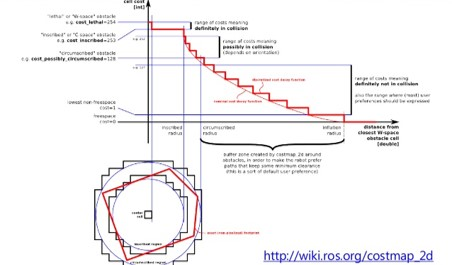

# Navigation2の概要


Navigation2はロボットの自律走行を実現するためのメタパッケージです。  
自己位置推定、地図生成、障害物検出、経路・動作計画などの機能を提供します。  
Navigation2は`ツール`と`プラグイン`で構成されています。  

---

## Navigation2が提供しているツール

- Map Server : マップのロード、提供、保存。
- AMCL : マップ上でロボットをローカライズ。
- Nav2 Planner : 障害物の周りのAからBへのパスを計画。
- Nav2 Controller : パスをたどるロボットを制御。
- Nav2 Costmap 2D : センサーデータを世界のコストマップ表現に変換。
- Nav2 Behavior Trees / BT Navigator : 複雑なロボットビヘイビアを構築。
- Nav2 Recoveries : 障害が発生した場合の回復動作の計算。
- Nav2 Waypoint Follower : シーケンシャルウェイポイントをフォロー。
- Nav2 Lifecycle Manager : サーバーのライフサイクルとウォッチドッグを管理。
- Nav2 Core : 独自のアルゴリズムと動作を有効にするプラグイン。

プラグインの一覧に関しては[本家ページ](https://navigation.ros.org/plugins/index.html)に詳細に書いてあります。


上記の自律走行の流れにある経路計画は`Nav2 Planner`、経路追従と障害物回避は`Nav2 Controller`が対応しています。

---

## 地図管理(nav2_map_server)パッケージ

nav2_map_serverパッケージには4個のノードがあります。

1. map_saver_cli(コマンドラインで地図保存)
2. map_saver_server(サービスコールで地図保存)
3. map_server(地図データからトピック配信)
4. costmap_filter_info_server(コストマップフィルタに使用)

map_saver_cliとmap_saver_serverは、受信(サブスクライブ)した地図データを、「`***.pgm`」と「`***.yaml`」の2つのファイルに保存します。

map_serverは、「`***.pgm`」と「`***.yaml`」の2つのファイルから、地図データを読み出し配信(パブリッシュ)します。

costmap_filter_info_serverは、mapトピックをサブスクライブし、6章で行う進入禁止エリアなどのコストマップフィルタの情報を配信します。

---

### 地図データの形式(占有格子地図)

今回の地図データは占有格子地図(Occupancy Grid Map)と呼ばれています。

-  各格子の占有確率(0～1)を0～255の画素値で表現した地図
- `***.pgm`ファイルに各格子の画素値が保存されている
- `***.yaml`ファイルに解像度や閾値などが保存されている


---

### 地図データの形式(yamlファイル)

```yaml
image: /home/user/map.pgm   #pgmファイルパス
mode: trinary               #読み込み形式
resolution: 0.05            #地図の解像度
origin: [-2.95, -2.57, 0]   #pgm画像の左下端地点の座標[x, y, yaw]
negate: 0                   #pgm画像の白黒反転
occupied_thresh: 0.65       #移動不可領域の閾値(0～1)
free_thresh: 0.25           #移動可能領域の閾値(0～1)
```


---

## 自己位置推定(nav2_amcl)パッケージ

/scanと/tf(オドメトリ)と/mapから地図上の自己位置を推定し、/tf(map→odom)を出力する


---

### 自己位置推定(amcl)のアルゴリズム


---

## 経路計画(Nav2 Planner)パッケージ
プラグイン形式で様々な経路計画アルゴリズムが使用でき、  
Global CostMapをもとに経路計画を行う

- nav2_navfn_planner/NavfnPlanner(デフォルト)
- nav2_smac_planner/SmacPlanner2D
- nav2_smac_planner/SmacPlannerHybrid
- nav2_smac_planner/SmacPlannerLattice
- nav2_theta_star_planner/ThetaStarPlanner


---

### global planner(経路計画の代表的なアルゴリズム)
目標位置までの最短経路を作る

- グリッドマップベースで最短経路を探索する
- グローバルコストマップに基づき計算
- ロボットの向き等の機構(移動方向)を気にしない


---

## 経路追従+障害物回避(Nav2 Controller)
経路計画結果を受け取り、経路追従を行いながら障害物回避を行う。
Local CostMapをもとに経路計画を行う

- dwb_core::DWBLocalPlanner(デフォルト)
- teb_local_planner::TebLocalPlannerROS
- nav2_regulated_pure_pursuit_controller::RegulatedPurePursuitController

---

### local planner(経路追従+障害物回避の代表的なアルゴリズム)
参照経路 + 局所的コストマップ + オドメトリを入力として受け取り、参照経路に追従しながら、障害物を回避する経路を生成する

DWA(ダイナミックウインドウアプローチ)

- 現在の速度付近でシミュレートして評価値が高い経路を選択
- 評価関数はグローバルパスに近いかつ障害物から遠いほど評価値が高い


---

## コストマップ

ロボットが移動可能な領域を考慮した地図  
下記の情報を用いて地図を作成

- ロボットの外形情報
-  取得したLRFデータ

取得された障害物情報の位置にロボットの外形情報を置くことで衝突エリアを作成し、衝突エリアから設定された距離に応じて減衰するコストマップを生成する。  
コストマップはレイヤー実装になっており、複数のレイヤーからコストマップを作成する。



---

### コストマップの種類

レイヤーはプラグイン実装になっており、自作することも可能
ROSwikiのcostmap_2d/Tutorials/Creating a New Layerを参照
代表的なのは下記の3種類

- StaticLayer  
地図情報(nav_msgs/OccupancyGrid)から静的なコストマップを生成する

- ObstacleLayer  
主にセンサ情報(sensor_msgs/LaserScan,PointCloud2)からコストマップを生成する  
レイキャスティング方式(光が通れた道は障害物がない)によりコストマップを削除できる
- InflationLayer  
他のレイヤーから生成されたコストマップを膨らませたコストマップを生成する  
走行時の壁からの距離を調整したい場合に便利

global_costmap

- 大域的経路計画(global planner)用のコストマップを作る
- 全領域が対象となり、読み込ませた地図から生成する⇒地図は静的で動かない
- 一般的にはstaticとinflationレイヤーを設定する

local_costmap

- 局所的経路計画(local planner)用のコストマップを作る
- ロボットの周辺が対象となり、LRFデータなどの障害物情報から生成する⇒地図は動的でロボットとともに動く
- 一般的にはobstaclesとinflationレイヤーを設定する