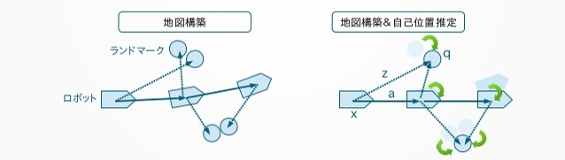

#　地図作成(SLAM)の説明と各種パッケージ入れ替え

---

## 1. SLAMとは
SLAMはSimultaneous Localization And Mappingの略で、自己位置推定と地図作成を同時に実行することです。

しかし実際には下記のような鶏が先か卵が先か問題がありました。

- 自己位置推定するには地図が必要
- 地図作成するには自己位置が必要

下記のように同時にやることで解決しました。

- (作成中の)地図から自己位置を推定する
- 推定した自己位置から地図生成を行う

---

## 2. SLAMの種類について

近年は地図の大規模化に伴い、Graph-Based SLAM系が主流です。  
ROS2のnavigation2標準のslam_toolboxはGraph-Based SLAM系です。

---

## 3. 2D-SLAMのパッケージ紹介

ROS2で使用できる2D-SLAMパッケージはまだ多くはありません。

|パッケージ名 |手法 |Loop検出 |オドメトリ|補足|
|-|-|-|-|-|
|Gmapping|Rao-Blackwellized ParticleFilterによるGrid-BasedSLAM|○|必須|ROS1標準|
|Cartographer|Graph-based SLAM+オンライン化|○|どちらでも|強力なLoop検出|
|slam_toolbox|cartographerの改良版。localSLAM(スキャンマッチング)をslam_kartoに変更|○|どちらでも|ROS2標準|

---

